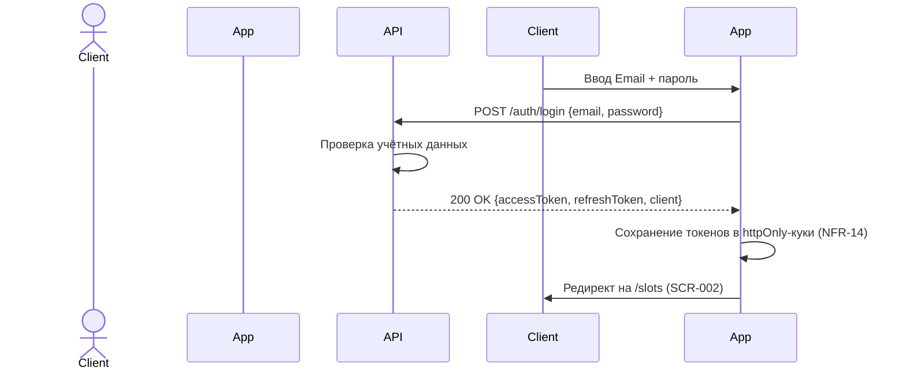
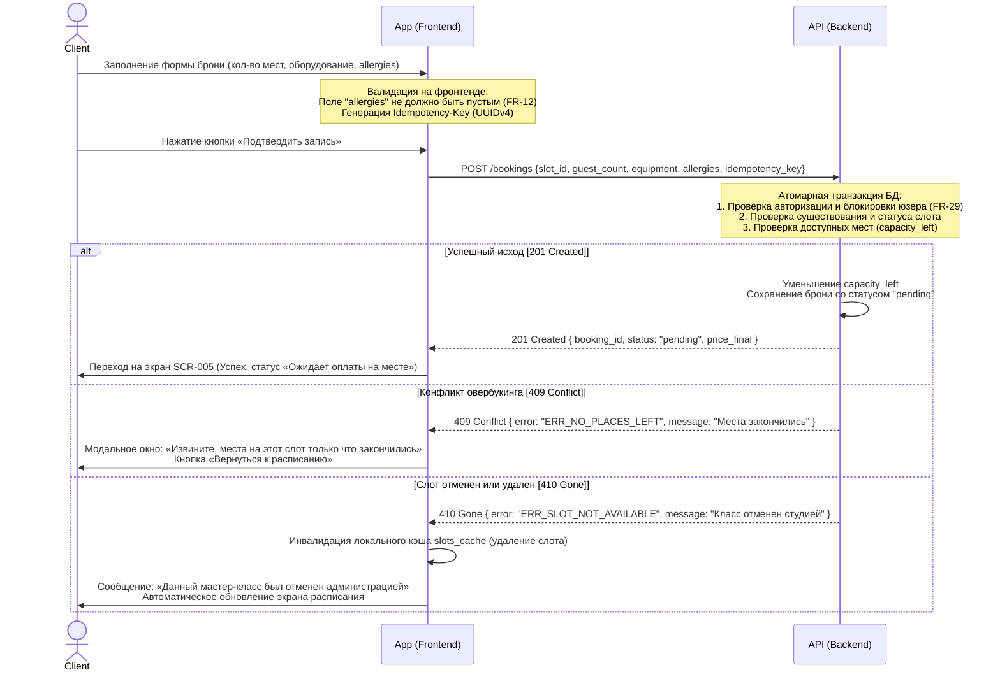
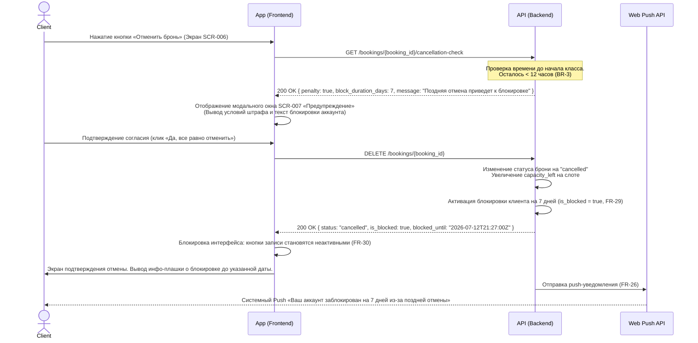

# API Sequence Diagrams — Версия 2 (Актуализированная)

Документ описывает последовательности вызовов API для ключевых сценариев клиентского приложения с использованием диаграмм последовательности (Mermaid). Каждая диаграмма показывает взаимодействие между Клиентом, Приложением, API и внешними сервисами.

**Обозначения:**
- `Клиент` — пользователь (актор)
- `Приложение` — клиентское веб-приложение (Frontend)
- `API` — серверная часть (Backend, black-box источник истины)
- `OAuth` — внешний OAuth-провайдер (Google/Яндекс)
- `Push` — сервис push-уведомлений (Web Push API)

---

## 1. Сценарий: Авторизация через Email + пароль (UC-1, FR-01)

**Поток:** SCR-001 «Авторизация» → POST /auth/login → SCR-002 «Главная / Расписание».

---

## 2. Сценарий: Создание бронирования (createBooking)

Процесс обработки транзакции бронирования со стороны фронтенда и API бэкенда. Особое внимание уделено обработке специфичных HTTP-статусов конфликтов и недоступности ресурсов:

* **`201 Created`** — Успешное выполнение. Бронирование создано на бэкенде, места успешно уменьшены, брони присвоен статус `pending` (оплата на месте).
* **`409 Conflict`** — Конфликт бизнес-логики. Возникает при попытке овербукинга. Мест в слоте осталось меньше, чем запросил пользователь, из-за параллельных транзакций других клиентов.
* **`410 Gone`** — Ресурс окончательно недоступен. Возникает, если мастер-класс (слот) был отменен администрацией студии по форс-мажорным обстоятельствам (FR-22) или полностью удален из сетки, пока клиент заполнял форму. Запись на него закрыта навсегда.

---
## 2.1. Шаги сценария создания бронирования (createBooking)

| Шаг | Действие (Фронтенд / Бэкенд) | Назначение и трассировка |
| :--- | :--- | :--- |
| **1** | Клиент заполняет форму и нажимает «Подтвердить запись». | Инициация бронирования. Проверка обязательности поля аллергий (FR-12). |
| **2** | App генерирует `idempotency_key` и отправляет `POST /bookings`. | Защита от повторных сетевых запросов при сбоях (NFR-5). |
| **3** | Бэкенд выполняет проверку блокировок, статуса слота и свободных мест. | Проверка бизнес-ограничений (FR-29) и атомарности мест в БД. |
| **4a** | **Ветка 201 Created**: Бэкенд резервирует места и возвращает успех. | Успешное завершение. Переход на экран подтверждения (SCR-005). |
| **4b** | **Ветка 409 Conflict**: Бэкенд отклоняет запрос (нет мест). | Обработка овербукинга. Вывод модального окна об ошибке. |
| **4c** | **Ветка 410 Gone**: Бэкенд отклоняет запрос (слот отменен студией). | Обработка форс-мажора (FR-22). Инвалидация кэша расписания на клиенте. |

---

## 3. Сценарий: Поздняя отмена бронирования (UC-4)

**Логика взаимодействия:** Фронтенд не отправляет DELETE-запрос вслепую. Сначала приложение запрашивает параметры отмены, выводит предупреждение о блокировке, получает явный акцепт пользователя и только потом производит удаление ресурса на сервере.

**Граница «ранней» и «поздней» отмены:** ровно 12 часов до старта мастер-класса согласно бизнес-правилу (`BR-3`).

---

## 4. Шаги сценария поздней отмены бронирования

| Шаг | Действие (Фронтенд / Бэкенд) | Назначение и трассировка |
| :--- | :--- | :--- |
| **1** | Клиент нажимает «Отменить» на экране деталей бронирования. | Инициация процесса отмены (UC-4, US-10). |
| **2** | App выполняет предпроверку: `GET /bookings/{id}/cancellation-check`. | Определение наличия штрафных санкций на основе времени до занятия (FR-19, BR-3). |
| **3** | App перехватывает ответ и рендерит предупреждающую модалку SCR-007. | Выполнение требования осознанного согласия клиента. Предотвращает случайные блокировки. |
| **4** | После клика согласия App отправляет `DELETE /bookings/{id}`. | Фиксация намерения произвести отмену. |
| **5** | Сервер обновляет сущности в БД и выставляет флаги блокировки `is_blocked`. | Применение бизнес-правил ограничений (FR-29). |
| **6** | App получает ответ `200 OK`, обновляет UI и блокирует элементы интерфейса. | Реализация ограничений интерфейса на клиенте (FR-30). |