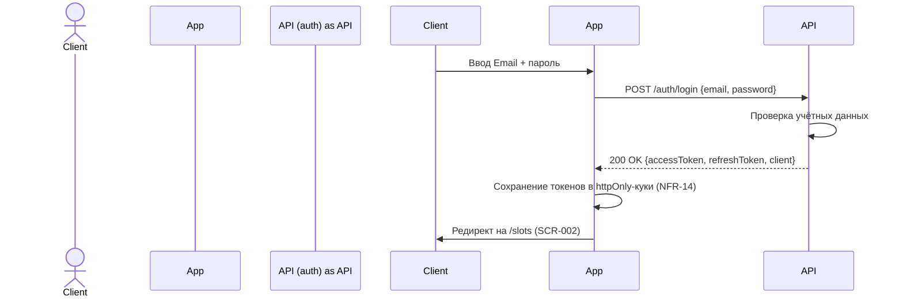
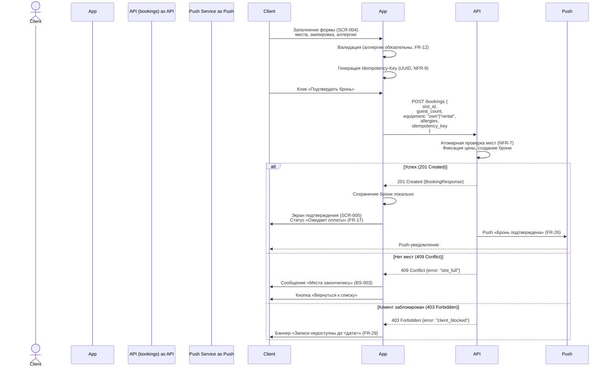
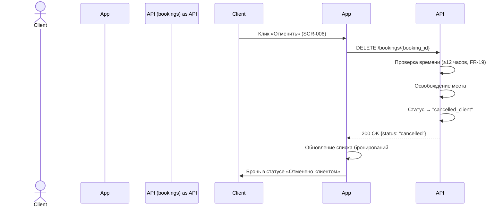
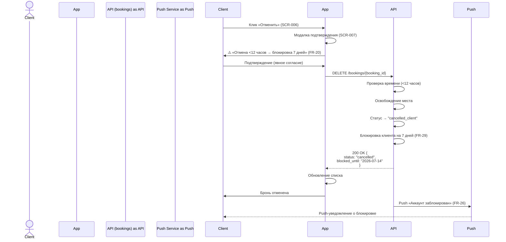

# API Sequence Diagrams

## Описание
Документ описывает последовательности вызовов API для ключевых сценариев клиентского приложения с использованием диаграмм последовательности (Mermaid). Каждая диаграмма показывает взаимодействие между Клиентом, Приложением, API и внешними сервисами.

**Обозначения:**
- `Клиент` — пользователь (актор)
- `Приложение` — клиентское веб-приложение (Frontend)
- `API` — серверная часть (Backend, black-box источник истины)
- `OAuth` — внешний OAuth-провайдер (Google/Яндекс)
- `Push` — сервис push-уведомлений (Web Push API)

---

## Сценарий 1: Авторизация через Email + пароль (UC-1, FR-01)

**Поток:** SCR-001 «Авторизация» → POST /auth/login → SCR-002 «Список слотов»

---

### Шаги сценария 1

| Шаг | Что происходит | Источник (Трассировка) |
| :--- | :--- | :--- |
| **1** | Пользователь вводит Email и пароль в форму авторизации (экран SCR-001). | UC-1, US-1 |
| **2** | Приложение отправляет запрос `POST /auth/login` с переданными учётными данными на бэкенд. | FR-01 |
| **3** | Бэкенд выполняет аутентификацию и валидацию пары email/пароль. | UC-1 (Основной поток, шаг 3) |
| **4** | Сервер возвращает сгенерированные JWT-токены и базовый профиль клиента (`200 OK`). | FR-01, US-1 |
| **5** | Приложение сохраняет токены доступа (`accessToken`, `refreshToken`) в безопасные `httpOnly-куки`. | NFR-14 |
| **6** | Пользователь перенаправляется на главный экран со списком доступных слотов (`/slots`). | UC-1, US-1 (экран SCR-002) |

---

## Сценарий 2: Создание брони (UC-6, FR-09…FR-17)

**Поток:** SCR-004 «Форма брони» → POST /bookings → BS-002 «Подтверждение» / BS-003 «Ошибка»

**Бизнес-правила:**
- Аллергии обязательны (FR-12, PII, NFR-11)
- Атомарная проверка мест (NFR-7, защита от овербукинга)
- Idempotency-Key для защиты от дублей (NFR-9)
- Итоговую цену считает сервер (read-only на клиенте)

---

### Шаги сценария 2 (Создание бронирования)

| Шаг | Что происходит | Источник (Трассировка) |
| :--- | :--- | :--- |
| **1** | Клиент заполняет форму бронирования на экране SCR-004 (кол-во мест, экипировка, обязательные аллергии). | UC-3, US-6, FR-12 |
| **2** | Приложение выполняет валидацию полей на фронтенде и генерирует уникальный `Idempotency-Key`. | NFR-9 |
| **3** | Отправляется запрос `POST /bookings` для резервирования мест на выбранный кулинарный класс. | FR-11, FR-13 |
| **4** | Сервер выполняет атомарную проверку доступности мест в базе данных и фиксирует финальную цену. | FR-14, NFR-7 (контроль овербукинга) |
| **5** | Сервер создает запись и возвращает успешный статус (`201 Created`). | UC-3 (Основной поток) |
| **6** | Приложение отображает экран подтверждения SCR-005 со статусом брони «Ожидает оплаты». | US-6, FR-15 |
| **7** | Сервер инициирует отправку push-уведомления на устройство пользователя о подтверждении записи. | FR-27, US-15 |

---

## Сценарий 3: Отмена брони — ранняя (≥12 часов) (UC-8, FR-19)

**Поток:** SCR-006 → DELETE /bookings → Обновление списка

---

### Шаги сценария 3 (Ранняя отмена бронирования)

| Шаг | Что происходит | Источник (Трассировка) |
| :--- | :--- | :--- |
| **1** | Клиент инициирует отмену занятия из карточки предстоящих броней на экране SCR-006. | UC-4, US-9 |
| **2** | Приложение отправляет запрос `DELETE /bookings/{booking_id}` на API-сервер. | FR-19 |
| **3** | Сервер проверяет время до начала мероприятия и валидирует условие «осталось 12 и более часов». | BR-3, FR-19 |
| **4** | Сервер освобождает зарезервированные места и переводит бронь в статус `cancelled_client` без штрафов. | UC-4 (Основной поток), FR-22 |
| **5** | API возвращает успешный ответ об отмене операции (`200 OK`). | FR-19 |
| **6** | Приложение обновляет локальное состояние интерфейса и выводит пользователю статус «Отменено клиентом». | US-9 |

---

## Сценарий 4: Отмена брони — поздняя (<12 часов) (UC-8, FR-20, FR-29)

**Поток:** SCR-006 → SCR-007 «Подтверждение отмены» → DELETE /bookings → Блокировка

**Бизнес-правило:** Граница «ранней» отмены — ровно 12 часов до старта (BR-3)

---

### Шаги сценария 4 (Поздняя отмена бронирования)

| Шаг | Что происходит | Источник (Трассировка) |
| :--- | :--- | :--- |
| **1** | Клиент нажимает кнопку отмены занятия в карточке бронирования на экране SCR-006. | UC-4, US-10 |
| **2** | Приложение без предварительных проверок отправляет запрос `DELETE /bookings/{booking_id}` на API-сервер. | FR-19 |
| **3** | Сервер проверяет время до начала класса и определяет, что осталось менее 12 часов. | BR-3, UC-4 (Поток E1) |
| **4** | Сервер меняет статус брони на `cancelled_client` и автоматически блокирует клиента на 7 дней. | FR-20, FR-29 |
| **5** | API возвращает ответ `200 OK` с новыми метаданными брони и датой окончания блокировки аккаунта. | FR-29, FR-30 |
| **6** | Приложение обновляет интерфейс, отображая пользователю информацию о том, что бронь отменена. | US-10 |
| **7** | Бэкенд отправляет push-уведомление на устройство клиента с официальным уведомлением о блокировке. | FR-26, US-15 |
---
