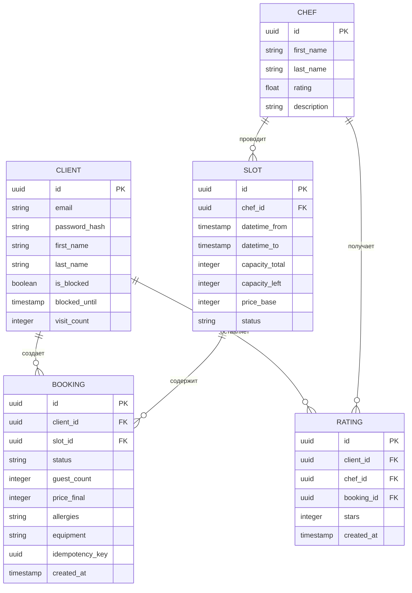

# Модель данных (Data Model)

В данном документе приведено детальное описание логической структуры данных клиентского веб-приложения и сопутствующего API. Модель обеспечивает реализацию требований к бизнес-логике бронирования, учет ограничений при отменах, систему лояльности и поддержку автономного (офлайн) режима.

---

## 1. ER-диаграмма связей (Entity-Relationship Diagram)

Связи между ключевыми сущностями системы на уровне базы данных (источника истины бэкенда).



## 2. Описание сущностей и права доступа приложения

В рамках текущего скоупа MVP клиентского веб-приложения сущности имеют следующую структуру и состав полей:

### 2.1. Сущность `CHEF` (Шеф-повара)
Данные о мастерах и ведущих кулинарных классов, которые отображаются пользователю при выборе занятия.
* `id` (UUID): Уникальный идентификатор шеф-повара.
* `first_name` (String): Имя шефа.
* `last_name` (String): Фамилия шефа.
* `rating` (Float): Средний рейтинг шефа, рассчитываемый на основе полученных оценок от клиентов.
* `description` (String): Краткая биография, регалии или описание кулинарного опыта.

### 2.2. Сущность `SLOT` (Расписание классов)
Временные интервалы в сетке расписания студии, на которые могут записываться клиенты.
* `id` (UUID): Уникальный идентификатор слота.
* `chef_id` (UUID): Идентификатор шеф-повара, который проводит данный класс.
* `datetime_from` (Timestamp): Дата и время начала мастер-класса.
* `datetime_to` (Timestamp): Дата и время окончания мастер-класса.
* `capacity_total` (Integer): Общее количество мест, предусмотренное для этого класса.
* `capacity_left` (Integer): Количество оставшихся свободных мест. Уменьшается при создании бронирований.
* `price_base` (Integer): Базовая стоимость участия за одного человека (в рублях).
* `status` (String): Статус доступности класса. Возможные значения: `active` (доступен для записи), `cancelled` (отменен администрацией студии).

### 2.3. Сущность `CLIENT` (Профиль клиента)
Учетная запись пользователя, содержащая персональные данные, историю активности и статус в системе лояльности.
* `id` (UUID): Уникальный идентификатор клиента.
* `email` (String): Уникальный электронный адрес (логин пользователя).
* `first_name` (String): Имя клиента.
* `last_name` (String): Фамилия клиента.
* `is_blocked` (Boolean): Признак активности блокировки аккаунта за нарушение правил студии.
* `blocked_until` (Timestamp): Дата и время, до которых действуют ограничения на создание новых записей.
* `visit_count` (Integer): Количество успешно посещенных мастер-классов. Используется для автоматического расчета скидки постоянного клиента при достижении лимита по FR-04.

### 2.4. Сущность `BOOKING` (Бронирования)
Записи клиентов на конкретные мастер-классы с указанием дополнительных параметров визита.
* `id` (UUID): Уникальный идентификатор бронирования.
* `client_id` (UUID): Идентификатор клиента, оформившего запись.
* `slot_id` (UUID): Идентификатор выбранного из расписания мастер-класса.
* `status` (String): Текущая стадия жизненного цикла брони. Возможные значения: `pending` (ожидает оплаты на месте), `paid` (оплачено), `cancelled` (отменено), `completed` (класс успешно завершен).
* `guest_count` (Integer): Общее число участников в рамках этой брони (клиент плюс его гости).
* `price_final` (Integer): Итоговая стоимость бронирования с учетом персональных скидок лояльности.
* `allergies` (String): Информация о пищевых аллергиях участников. Обязательное поле для заполнения при оформлении (FR-12).
* `equipment` (String): Перечень дополнительного инвентаря или оборудования, запрошенного клиентом.
* `idempotency_key` (UUID): Уникальный токен операции, генерируемый фронтендом для исключения повторного создания дублирующих записей при сетевых сбоях.
* `created_at` (Timestamp): Дата и время оформления записи.

### 2.5. Сущность `RATING` (Отзывы)
Оценки работы шеф-поваров, выставляемые клиентами после завершения занятий.
* `id` (UUID): Уникальный идентификатор отзыва.
* `client_id` (UUID): Идентификатор автора оценки.
* `chef_id` (UUID): Идентификатор оцениваемого шеф-повара.
* `booking_id` (UUID): Идентификатор завершенной брони, к которой привязан отзыв.
* `stars` (Integer): Оценка по шкале от 1 до 5 звезд.
* `created_at` (Timestamp): Дата и время отправки отзыва.

---

## 3. Локальное кэширование приложения (Frontend Storage)

Для выполнения требований `NFR-9` по поддержке автономного/офлайн-режима, на стороне браузера в `localStorage` кэшируются справочные данные.

### 3.1. Кэш расписания слотов (`slots_cache`)
Обновляется при вызове `GET /slots`.
```json
{
  "updated_at": "2026-07-05T20:30:00Z",
  "slots": [
    {
      "id": "e8b2b73a-4f51-4e4b-972a-194165dc9b01",
      "datetime_from": "2026-07-06T18:00:00Z",
      "datetime_to": "2026-07-06T21:00:00Z",
      "capacity_left": 4,
      "price_base": 5000,
      "status": "active",
      "chef": {
        "id": "c1a9f143-bc82-4512-8bb4-012932da1111",
        "name": "Иван Иванов",
        "rating": 4.9
      }
    }
  ]
}
```

### 3.2. Управление токенами и сессией (Cookies & Session Storage)
* **Сессионные токены:** `accessToken` и `refreshToken` сохраняются в защищенных `httpOnly` куках бэкендом для обеспечения безопасности авторизации согласно `NFR-14`.
* **Флаги состояния профиля:** Идентификатор текущего авторизованного пользователя и признак наличия активной скидки лояльности кэшируются в `sessionStorage` для оптимизации рендеринга элементов интерфейса без повторных сетевых запросов.