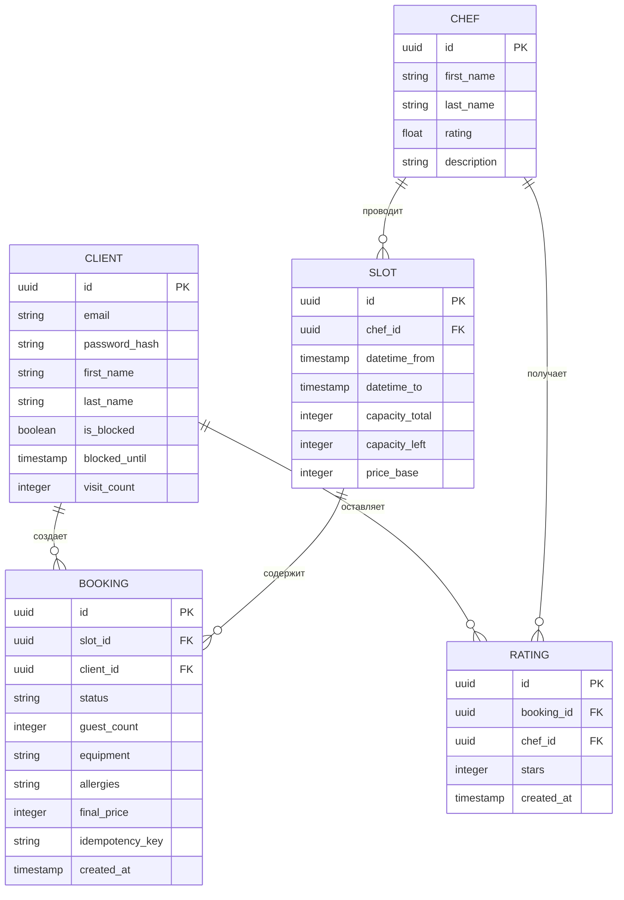

# Модель данных (Data Model)

В данном документе приведено детальное описание логической структуры данных клиентского веб-приложения и сопутствующего API. Модель обеспечивает реализацию требований к бизнес-логике бронирования, учет ограничений при отменах, систему лояльности и поддержку автономного (офлайн) режима.

---

## 1. ER-диаграмма связей (Entity-Relationship Diagram)

Связи между ключевыми сущностями системы на уровне базы данных (источника истины бэкенда).



## 2. Сущности (Entities)

В рамках разрабатываемой системы выделены следующие основные сущности:
* **Client** — клиент кулинарной студии (пользователь веб-приложения).
* **Chef** — шеф-повар, проводящий мастер-класс.
* **Slot** — доступный временной слот в расписании кулинарных классов.
* **Booking** — бронирование (запись) клиента на конкретный слот.
* **Rating** — оценка шеф-повара, выставленная клиентом после визита.

---

## 3. Модель хранения бэкенда (Backend DB Model)

### 3.1. Client (Клиенты кулинарной студии)

| Поле | Тип данных | Nullable | Описание | Трассировка |
| :--- | :--- | :---: | :--- | :--- |
| `id` | UUID | Нет | Уникальный системный идентификатор клиента | — |
| `email` | String | Нет | Электронная почта (логин, уникальное значение) | UC-1, US-1, FR-01 |
| `password_hash` | String | Нет | Хэш пароля для безопасной аутентификации | FR-01 |
| `first_name` | String | Нет | Имя клиента | FR-05 |
| `last_name` | String | Нет | Фамилия клиента | FR-05 |
| `is_blocked` | Boolean | Нет | Флаг активного бана за нарушения (Default: `false`) | BR-3, FR-29 |
| `blocked_until` | Timestamp | Да | Срок окончания блокировки (бан на 7 дней) | BR-3, FR-29, FR-30 |
| `visit_count` | Integer | Нет | Количество успешно завершенных визитов (Default: `0`) | US-2, FR-03, FR-04 |

### 3.2. Chef (Шеф-повара)

| Поле | Тип данных | Nullable | Описание | Трассировка |
| :--- | :--- | :---: | :--- | :--- |
| `id` | UUID | Нет | Уникальный идентификатор шеф-повара | — |
| `first_name` | String | Нет | Имя шефа | US-4, FR-07 |
| `last_name` | String | Нет | Фамилия шефа | US-4, FR-07 |
| `rating` | Float | Нет | Средняя оценка по отзывам | US-14, FR-07, FR-24 |
| `description` | Text | Да | Профессиональная биография, специализация шефа | US-4, FR-07 |

### 3.3. Slot (Временные слоты мастер-классов)

| Поле | Тип данных | Nullable | Описание | Трассировка |
| :--- | :--- | :---: | :--- | :--- |
| `id` | UUID | Нет | Уникальный идентификатор временного слота | — |
| `chef_id` | UUID | Нет | Ссылка на ведущего шеф-повара (Внешний ключ) | FR-07 |
| `datetime_from` | Timestamp | Нет | Дата и время начала мастер-класса | UC-3, US-3, US-5 |
| `datetime_to` | Timestamp | Нет | Дата и время завершения мастер-класса | UC-3 |
| `capacity_total` | Integer | Нет | Максимально возможная общая вместимость слота | NFR-7 |
| `capacity_left` | Integer | Нет | Текущее количество свободных мест для записи | FR-14, NFR-7 |
| `price_base` | Integer | Нет | Базовая стоимость участия за 1 человека | US-2, FR-04, FR-14 |

### 3.4. Booking (Бронирования клиентов)

| Поле | Тип данных | Nullable | Описание | Трассировка |
| :--- | :--- | :---: | :--- | :--- |
| `id` | UUID | Нет | Уникальный идентификатор бронирования | — |
| `slot_id` | UUID | Нет | Ссылка на бронируемый слот расписания (Внешний ключ) | FR-11 |
| `client_id` | UUID | Нет | Ссылка на аккаунт автора записи (Внешний ключ) | FR-11 |
| `status` | Enum | Нет | Статус записи: `pending`, `confirmed`, `completed`, `cancelled_client`, `cancelled_studio` | US-9, US-13, FR-15, FR-22 |
| `guest_count` | Integer | Нет | Количество бронируемых мест | UC-3, US-6, FR-11 |
| `equipment` | Text | Да | Перечень заказанного дополнительного оборудования | US-6, FR-11 |
| `allergies` | Text | Нет | Текстовое описание пищевых аллергий (Обязательное) | BR-4, US-6, FR-12 |
| `final_price` | Integer | Нет | Финальная стоимость с учетом скидки лояльности | US-2, FR-04, FR-14 |
| `idempotency_key`| UUID | Нет | Уникальный токен транзакции для предотвращения дублей | NFR-9 |
| `created_at` | Timestamp | Нет | Дата и время создания бронирования | — |

### 3.5. Rating (Оценки работы шеф-поваров)

| Поле | Тип данных | Nullable | Описание | Трассировка |
| :--- | :--- | :---: | :--- | :--- |
| `id` | UUID | Нет | Уникальный идентификатор оценки | — |
| `booking_id` | UUID | Нет | Ссылка на бронь (Уникальный ключ, гарантирует 1 оценку) | US-14, FR-23 |
| `chef_id` | UUID | Нет | Ссылка на оцениваемого шеф-повара (Внешний ключ) | FR-23 |
| `stars` | Integer | Нет | Оценка от 1 до 5 звезд | US-14, FR-23 |
| `created_at` | Timestamp | Нет | Дата и время отправки оценки | — |

---

## 4. Локальное хранилище клиента (Front Cache & State)

В соответствии с требованиями к производительности и поддержке офлайн-режима (`NFR-9`), часть данных кэшируется локально средствами браузера (`localStorage` / `IndexedDB`).

### 4.1. Кэш расписания слотов (`slots_cache`)
Обновляется при каждом успешном ответе от эндпоинта `GET /slots`. Хранит срез данных на ближайшие 7 дней.

```json
{
  "updated_at": "2026-07-05T20:30:00Z",
  "slots": [
    {
      "id": "e8b2b73a-4f51-4e4b-972a-194165dc9b01",
      "datetime_from": "2026-07-06T18:00:00Z",
      "datetime_to": "2026-07-06T21:00:00Z",
      "capacity_left": 4,
      "price_base": 5000,
      "chef": {
        "id": "c1a9f143-bc82-4512-8bb4-012932da1111",
        "name": "Иван Иванов",
        "rating": 4.9
      }
    }
  ]
}
```

### 4.2. Управление токенами и сессией (Cookies)

В рамках обеспечения безопасности (`NFR-14`), данные авторизации не считываются скриптами фронтенда напрямую, а делегированы встроенным механизмам безопасности браузера.

* `accessToken` — Передается в заголовке `Authorization: Bearer`, время жизни составляет 15 минут.
* `refreshToken` — Хранится на клиенте исключительно в виде куки со следующими установленными флагами безопасности:
  * `httpOnly` — защита от чтения токена через JavaScript и XSS-атак;
  * `Secure` — передача куки только по зашифрованному протоколу HTTPS;
  * `SameSite=Strict` — защита от CSRF-атак (куки не отправляются при сторонних переходах). 
   Используется бэкендом автоматически при обращении клиента к эндпоинту `/auth/refresh`.