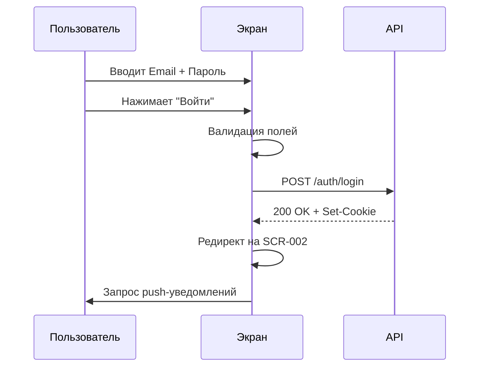

# 5-desktop-app-spec/SCR-001-registration.md

# Регистрация и авторизация

**ID:** SCR-001

**Тип:** Экран

**Домен:** 01. Авторизация

**Приоритет:** Critical

**Статус:** Актуален

**Зона авторизации:** НЗ + АЗ

---

## Содержание

- [Обзор](#обзор)
- [Навигация](#навигация)
- [Входные данные](#входные-данные)
- [Макет экрана](#макет-экрана)
- [Элементы экрана](#элементы-экрана)
- [Состояния экрана](#состояния-экрана)
- [Действия пользователя](#действия-пользователя)
- [Связанные требования](#связанные-требования)
- [Критерии приёмки](#критерии-приёмки)

---

## Обзор

Экран для входа зарегистрированных клиентов или регистрации новых пользователей. Поддерживает авторизацию по Email+пароль и OAuth (Google, Яндекс).

### User Story

> Как клиент студии, я хочу войти в аккаунт, чтобы записываться на кулинарные классы и управлять своими бронированиями.

### Бизнес-ценность

- Быстрый доступ к функционалу бронирования
- Возможность отслеживать историю посещений
- Получение персонализированных уведомлений

---

## Навигация

### Вход на экран
- Прямой переход при отсутствии авторизации
- Редирект с защищённых экранов при истечении сессии

### Выход с экрана
- Успешная авторизация → SCR-002 (Список слотов)

---

## Входные данные

| Название | Тип | Возможные значения | Описание |
|----------|-----|-------------------|----------|
| `redirect_url` | Query параметр | URL | URL для редиректа после успешной авторизации |

---

## Макет экрана

## Макет экрана

### Структура

**Область 1: Шапка**
| Позиция | Элемент | Описание |
|---------|---------|----------|
| Центр | Логотип студии | Статичный |
| Под логотипом | Заголовок | «Вход в кулинарную студию» |

**Область 2: Форма входа**
| Позиция | Элемент | Описание |
|---------|---------|----------|
| Верх | Поле «Email» | Input с валидацией формата |
| Ниже | Поле «Пароль» | Input с маской + иконка 👁️ (toggle видимости) |
| Под полем пароля | Ссылка «Забыли пароль?» | Placeholder (вне MVP) |
| Ниже | Кнопка «Войти» | Primary button |

**Область 3: Разделитель**
| Позиция | Элемент | Описание |
|---------|---------|----------|
| По центру | Текст «или» | Разделитель между способами входа |

**Область 4: OAuth**
| Позиция | Элемент | Описание |
|---------|---------|----------|
| Ниже разделителя | Кнопка «Войти через Google» | С иконкой [G] |
| Ниже | Кнопка «Войти через Яндекс» | С иконкой [Я] |

### Компоненты

| Компонент | Описание | Обязательность |
|-----------|----------|----------------|
| Login Form | Форма Email + Пароль | Да |
| OAuth Buttons | Кнопки Google и Яндекс | Да |
| Divider | Разделитель «или» | Да |
| Primary Button | Кнопка «Войти» | Да |

---

## Элементы экрана

### 1. Форма входа

| Элемент | Описание | Источник данных | Валидация | Действие |
|---------|----------|-----------------|-----------|----------|
| Поле "Email" | Email пользователя | Ввод пользователя | Формат email. Ошибка: "Введите корректный Email" | — |
| Поле "Пароль" | Пароль пользователя | Ввод пользователя | Минимум 6 символов. Ошибка: "Пароль слишком короткий" | Toggle видимости |
| Кнопка "Войти" | Primary button | — | — | POST /auth/login |
| Ссылка "Забыли пароль?" | Восстановление пароля | — | — | Placeholder (вне MVP) |

**Момент валидации:** При потере фокуса + при отправке формы

**Логика:**
- Кнопка "Войти" активна, если: Email и Пароль заполнены И валидация пройдена
- При клике на "Toggle видимости" пароль становится видимым/скрытым

### 2. OAuth авторизация

| Элемент | Описание | Источник данных | Валидация | Действие |
|---------|----------|-----------------|-----------|----------|
| Кнопка "Войти через Google" | OAuth Google | — | — | OAuth flow Google |
| Кнопка "Войти через Яндекс" | OAuth Яндекс | — | — | OAuth flow Яндекс |

**Условия доступности:**
- Кнопки OAuth неактивны, если сервис недоступен (fallback на Email+пароль)

---

## Состояния экрана

### 1. Пустая форма
- Поля пустые
- Кнопка "Войти" активна
- OAuth кнопки активны

### 2. Ошибки валидации
- Неверный формат Email → inline ошибка под полем
- Пустой пароль → inline ошибка под полем
- Кнопка "Войти" остается active (валидация при отправке)

### 3. Ошибка авторизации
- Баннер: "Неверный Email или пароль"
- Поля очищаются
- Фокус на поле Email

### 4. OAuth недоступен
- Toast: "Сервис временно недоступен, попробуйте Email + пароль"
- Кнопки OAuth становятся `disabled`

### 5. Успешный вход
- Редирект на SCR-002 (Список слотов)
- Запрос разрешения на push-уведомления

---

## Действия пользователя

### Успешная авторизация (Email+пароль)

## Связанные требования

### Функциональные (FR)

| ID | Название | Приоритет |
|----|----------|-----------|
| FR-01 | Вход по Email + пароль | Critical |
| FR-02 | OAuth: Google, Яндекс | High |
| FR-03 | Запрос разрешения на push-уведомления | High |

### Нефункциональные (NFR)

| ID | Название | Приоритет |
|----|----------|-----------|
| NFR-3 | Время первого входа p95 < 3.0 с | High |
| NFR-10 | OAuth fallback на Email+пароль | Medium |
| NFR-14 | Токены в httpOnly cookies | Critical |
| NFR-19 | WCAG 2.1 AA | High |

## Критерии приёмки

| ID | Критерий |
|----|----------|
| AC-001 | **Дано** пользователь на экране авторизации, **Когда** вводит валидный Email и Пароль и нажимает "Войти", **Тогда** происходит успешная авторизация и редирект на SCR-002 |
| AC-002 | **Дано** пользователь на экране авторизации, **Когда** вводит невалидный Email, **Тогда** отображается ошибка "Введите корректный Email" |
| AC-003 | **Дано** пользователь на экране авторизации, **Когда** OAuth провайдер недоступен, **Тогда** отображается сообщение о недоступности и кнопки OAuth становятся неактивными |
| AC-004 | **Дано** пользователь успешно авторизовался, **Когда** открывается главный экран, **Тогда** запрашивается разрешение на push-уведомления |
| AC-005 | **Дано** пользователь использует клавиатуру, **Когда** нажимает Tab, **Тогда** фокус перемещается между полями формы и кнопками в логическом порядке |

