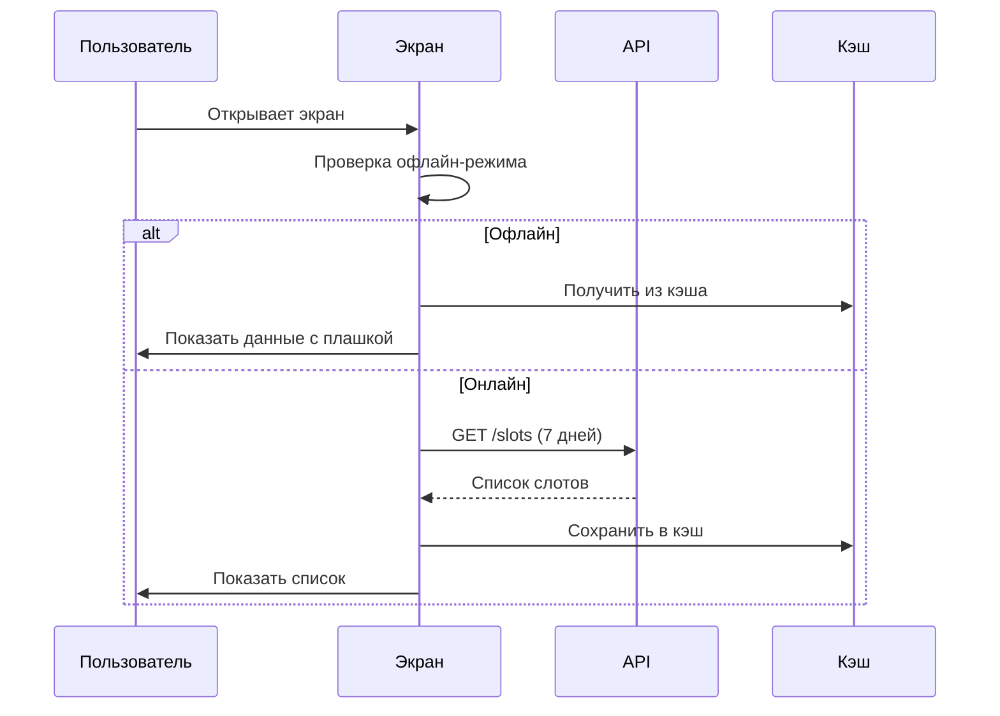
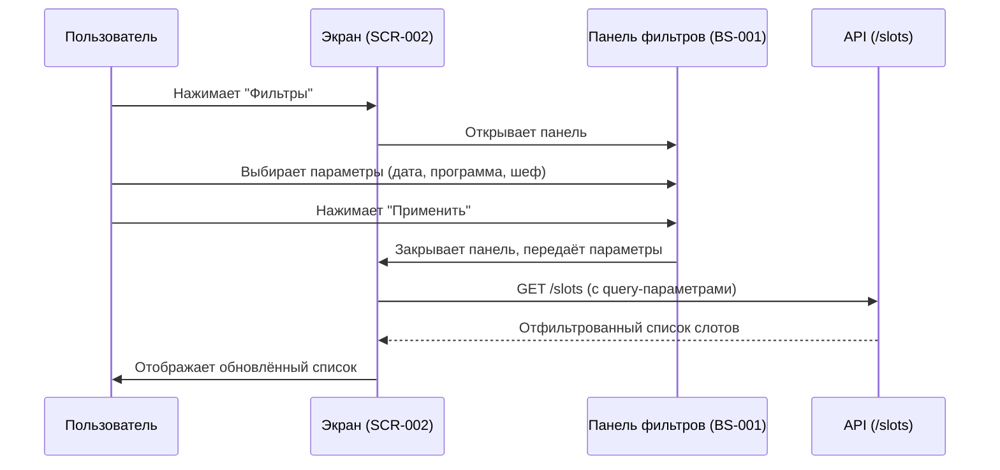

# 5-desktop-app-spec/SCR-002-slot-list.md

# Список слотов

**ID:** SCR-002

**Тип:** Экран

**Домен:** 02. Просмотр слотов

**Приоритет:** Critical

**Статус:** Актуален

**Зона авторизации:** АЗ

---

## Содержание

- [Обзор](#обзор)
- [Навигация](#навигация)
- [Входные данные](#входные-данные)
- [Применяемые логики](#применяемые-логики)
- [Макет экрана](#макет-экрана)
- [Элементы экрана](#элементы-экрана)
- [Состояния экрана](#состояния-экрана)
- [Действия пользователя](#действия-пользователя)
- [Связанные требования](#связанные-требования)
- [Критерии приёмки](#критерии-приёмки)

---

## Обзор

Главный экран приложения, отображающий список доступных кулинарных классов на ближайшие 7 дней с группировкой по дате. Поддерживает фильтрацию и расширение диапазона дат.

### User Story

> Как клиент студии, я хочу видеть список доступных кулинарных классов, чтобы выбрать подходящий для записи.

### Бизнес-ценность

- Быстрый обзор доступных слотов
- Удобная навигация по датам
- Возможность фильтрации по предпочтениям

---

## Навигация

### Вход на экран
- После успешной авторизации (SCR-001)
- Кнопка "Главная" в навигации
- Редирект после успешного бронирования

### Выход с экрана
- Клик по карточке слота → SCR-003 (Детали слота)
- Клик по фильтру → BS-001 (Панель фильтров)

---

## Входные данные

| Название | Тип | Возможные значения | Описание |
|----------|-----|-------------------|----------|
| `date_from` | Query параметр | ISO 8601 | Начало диапазона дат |
| `date_to` | Query параметр | ISO 8601 | Конец диапазона дат |
| `program` | Query параметр | string | Фильтр по программе |
| `chef_id` | Query параметр | UUID | Фильтр по шефу |
| `only_available` | Query параметр | boolean | Только со свободными местами |

---

## Применяемые логики

| Логика | Элемент/Триггер | Описание |
|--------|-----------------|----------|
| BS-001 | Кнопка "Фильтры" | Открытие панели фильтров |
| BS-005 | При загрузке | Офлайн-режим (кэширование) |
| BS-004 | При наличии блокировки | Баннер блокировки |

---

## Макет экрана

### Структура

**Область 1: Шапка**
| Позиция | Элемент | Описание |
|---------|---------|----------|
| Левая часть | Логотип студии | Статичный |
| Правая часть | Иконка «Уведомления» (колокольчик) | С бейджем непрочитанных |
| Правая часть | Иконка «Профиль» | Аватар/инициалы |

**Область 2: Заголовок и фильтры**
| Позиция | Элемент | Описание |
|---------|---------|----------|
| Верх | Заголовок | «Кулинарные классы» |
| Под заголовком | Кнопка «Фильтры» | Открывает панель BS-001 |
| Под кнопкой | Активные фильтры (теги) | Например: «Программа: Итальянская ×», «Шеф: Иван ×» |

**Область 3: Список слотов**
| Позиция | Элемент | Описание |
|---------|---------|----------|
| Группа 1 | Заголовок группы | «Сегодня, 6 июля» |
| Карточка 1 | Слот 1 | Время, программа, шеф, цена, места |
| Карточка 2 | Слот 2 | Время, программа, шеф, цена, места |
| Группа 2 | Заголовок группы | «Завтра, 7 июля» |
| Карточка 3 | Слот 3 | Время, программа, шеф, цена, места |

**Область 4: Кнопка расширения**
| Позиция | Элемент | Описание |
|---------|---------|----------|
| Низ списка | Кнопка «Показать ещё ↓» | Расширение диапазона дат |

### Компоненты

| Компонент | Описание | Обязательность |
|-----------|----------|----------------|
| Header | Шапка с логотипом и навигацией | Да |
| Filter Panel | Панель фильтров и активные теги | Да |
| Slot Card | Карточка слота с основной информацией | Да |
| Date Group | Заголовок группы по дате | Да |
| Load More Button | Кнопка расширения диапазона | Опционально |

---

## Элементы экрана

### 1. Header

| Элемент | Описание | Источник данных | Валидация | Действие |
|---------|----------|-----------------|-----------|----------|
| Логотип | Логотип студии | Статичный | — | — |
| Иконка "Уведомления" | Колокольчик с бейджем | `unread_count` из SCR-010 | — | Открыть SCR-010 |
| Иконка "Профиль" | Аватар пользователя | `client` из кэша | — | Открыть SCR-009 |

**Логика:**
- Бейдж на колокольчике отображается, если `unread_count > 0`

### 2. Панель фильтров

| Элемент | Описание | Источник данных | Валидация | Действие |
|---------|----------|-----------------|-----------|----------|
| Кнопка "Фильтры" | Открытие панели фильтров | — | — | Открыть BS-001 |
| Активные фильтры | Теги с применёнными фильтрами | Query параметры | — | — |
| Крестик на теге | Удаление фильтра | — | — | Удалить фильтр + GET /slots |

**Логика:**
- При удалении тега → обновление списка через GET /slots

### 3. Список слотов

| Элемент | Описание | Источник данных | Валидация | Действие |
|---------|----------|-----------------|-----------|----------|
| Заголовок группы | "Сегодня", "Завтра", "Пн, 10 июля" | `datetime_from` из `SlotWithChef` | — | — |
| Карточка слота | Карточка с информацией о слоте | `SlotWithChef` из GET /slots | — | Переход на SCR-003 |
| Кнопка "Показать ещё" | Расширение диапазона | — | — | Обновить `date_to` + GET /slots |

**Условия доступности:**
- Кнопка "Показать ещё" скрыта, если загружены все доступные слоты

---

## Состояния экрана

### 1. Загрузка
- Skeleton-экран для карточек слотов
- Длительность: p95 < 2.0 с (NFR-4)

### 2. Empty state (нет слотов вообще)
- Иконка: календарь или пустая тарелка
- Заголовок: "Пока нет доступных классов"
- Текст: "Попробуйте расширить диапазон дат или зайдите позже"
- Кнопка: "Расширить диапазон"

### 3. Empty state (нет по фильтру)
- Иконка: фильтр или лупа
- Заголовок: "По вашему запросу ничего не найдено"
- Текст: "Попробуйте изменить фильтры"
- Кнопка: "Сбросить фильтры"

### 4. Ошибка загрузки
- Баннер: "Не удалось загрузить расписание"
- Кнопка: "Повторить"

### 5. Офлайн (данные из кэша)
- Жёлтая плашка сверху: "⚠️ Данные могли устареть"
- Список отображается из кэша
- Кнопки действий активны

### 6. Блокировка клиента
- Баннер: "Записи недоступны до <дата>"
- Все кнопки "Записаться" в карточках `disabled`

---

## Действия пользователя

### Загрузка списка слотов

### Применение фильтра

## Связанные требования

### Функциональные (FR)

| ID | Название | Приоритет |
|----|----------|-----------|
| FR-05 | Список слотов на 7 дней | Critical |
| FR-06 | Фильтры слотов | High |
| FR-08 | Группировка по дате | Medium |
| FR-30 | Блокировка кнопок при блокировке клиента | Critical |

### Нефункциональные (NFR)

| ID | Название | Приоритет |
|----|----------|-----------|
| NFR-1 | Desktop-first, breakpoint ≥ 1280 px | Critical |
| NFR-4 | Время загрузки экранов p95 < 2.0 с | High |
| NFR-9 | Офлайн-режим (кэширование) | High |
| NFR-19 | WCAG 2.1 AA | High |

## Критерии приёмки

| ID | Критерий |
|----|----------|
| AC-001 | **Дано** пользователь авторизован, **Когда** открывает главный экран, **Тогда** отображается список слотов на ближайшие 7 дней с группировкой по дате |
| AC-002 | **Дано** пользователь на экране списка слотов, **Когда** кликает на карточку слота, **Тогда** происходит переход на SCR-003 |
| AC-003 | **Дано** пользователь на экране списка слотов, **Когда** применяет фильтр, **Тогда** список обновляется согласно фильтру |
| AC-004 | **Дано** слотов нет, **Когда** пользователь открывает экран, **Тогда** отображается empty state с кнопкой "Расширить диапазон" |
| AC-005 | **Дано** клиент заблокирован, **Когда** открывается экран, **Тогда** все кнопки "Записаться" неактивны и отображается баннер блокировки |
| AC-006 | **Дано** нет подключения к интернету, **Когда** открывается экран, **Тогда** данные загружаются из кэша с плашкой "Данные могли устареть" |
