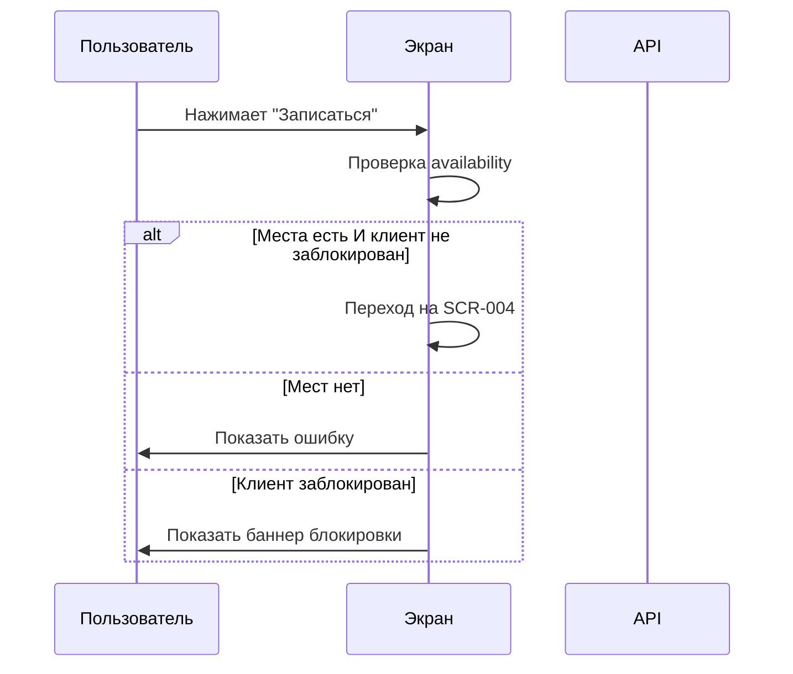

# 5-desktop-app-spec/SCR-003-slot-card.md

# Карточка слота

**ID:** SCR-003

**Тип:** Экран

**Домен:** 02. Просмотр слотов

**Приоритет:** Critical

**Статус:** Актуален

**Зона авторизации:** АЗ

---

## Содержание

- [Обзор](#обзор)
- [Навигация](#навигация)
- [Входные данные](#входные-данные)
- [Применяемые логики](#применяемые-логики)
- [Макет экрана](#макет-экрана)
- [Элементы экрана](#элементы-экрана)
- [Состояния экрана](#состояния-экрана)
- [Действия пользователя](#действия-пользователя)
- [Связанные требования](#связанные-требования)
- [Критерии приёмки](#критерии-приёмки)

---

## Обзор

Экран с детальной информацией о кулинарном классе: программа, шеф, меню, стоимость, доступные места. Содержит кнопку "Записаться" для перехода к бронированию.

### User Story

> Как клиент студии, я хочу изучить все детали кулинарного класса, чтобы принять решение о записи.

### Бизнес-ценность

- Полная информация о классе перед бронированием
- Возможность оценить шефа по рейтингу
- Прозрачность стоимости

---

## Навигация

### Вход на экран
- Клик по карточке слота на SCR-002

### Выход с экрана
- Кнопка "Назад" → SCR-002
- Кнопка "Записаться" → SCR-004 (Форма бронирования)

---

## Входные данные

| Название | Тип | Возможные значения | Описание |
|----------|-----|-------------------|----------|
| `slot_id` | URL параметр | UUID | ID слота |

---

## Применяемые логики

| Логика | Элемент/Триггер | Описание |
|--------|-----------------|----------|
| BS-004 | При наличии блокировки | Баннер блокировки |
| BS-005 | При загрузке | Офлайн-режим (кэширование) |

---

## Макет экрана

### Структура

**Область 1: Шапка**
| Позиция | Элемент | Описание |
|---------|---------|----------|
| Левая часть | Кнопка «Назад» ← | Возврат к списку |
| Центр | Заголовок | Название программы |

**Область 2: Основная информация**
| Позиция | Элемент | Описание |
|---------|---------|----------|
| Карточка | Дата и время | «Суббота, 10 июля, 15:00» |
| Карточка | Длительность | «~3 часа» |

**Область 3: Информация о шефе**
| Позиция | Элемент | Описание |
|---------|---------|----------|
| Карточка | Фото шефа | Аватар (если есть) |
| Карточка | Имя шефа | «Иван Петров» |
| Карточка | Рейтинг | «⭐ 4.9 (127 оценок)» |

**Область 4: Программа**
| Позиция | Элемент | Описание |
|---------|---------|----------|
| Карточка | Название программы | «Классическая итальянская кухня» |
| Карточка | Меню | Список блюд (паста карбонара, тирамису, брускетта) |
| Карточка | Что включено | Ингредиенты, экипировка |

**Область 5: Стоимость**
| Позиция | Элемент | Описание |
|---------|---------|----------|
| Карточка | Базовая цена | «5 000 ₽ / человек» |
| Карточка | Прокат экипировки | «+500 ₽ (фартук + ножи)» |

**Область 6: Места**
| Позиция | Элемент | Описание |
|---------|---------|----------|
| Карточка | Индикатор мест | «5 из 12 мест свободно» + прогресс-бар |

**Область 7: Адрес**
| Позиция | Элемент | Описание |
|---------|---------|----------|
| Карточка | Адрес студии | «ул. Заводская, 15, лофт 404» |
| Карточка | Ссылка на карту | «Посмотреть на карте» |

**Область 8: Кнопка действия**
| Позиция | Элемент | Описание |
|---------|---------|----------|
| Низ экрана | Кнопка «Записаться» | Primary button (активна при наличии мест) |

### Компоненты

| Компонент | Описание | Обязательность |
|-----------|----------|----------------|
| Header | Шапка с кнопкой «Назад» | Да |
| Chef Card | Карточка шефа с рейтингом | Да |
| Program Details | Описание программы и меню | Да |
| Price Block | Блок стоимости | Да |
| Capacity Indicator | Индикатор свободных мест | Да |
| Address Block | Адрес студии | Да |
| CTA Button | Кнопка «Записаться» | Да |

---

## Элементы экрана

### 1. Header

| Элемент | Описание | Источник данных | Валидация | Действие |
|---------|----------|-----------------|-----------|----------|
| Кнопка "Назад" | Возврат к списку | — | — | Переход на SCR-002 |
| Заголовок | Название программы | `program.name` из GET /slots | — | — |

### 2. Основная информация

| Элемент | Описание | Источник данных | Валидация | Действие |
|---------|----------|-----------------|-----------|----------|
| Дата и время | "Суббота, 10 июля, 15:00" | `datetime_from` из GET /slots | — | — |
| Длительность | "~3 часа" | Статичная информация | — | — |
| Фото шефа | Аватар шефа | `chef.photo` из GET /slots | — | — |
| Имя шефа | "Иван Петров" | `chef.name` из GET /slots | — | — |
| Рейтинг шефа | "⭐ 4.9 (127 оценок)" | `chef.rating` из GET /slots | — | — |

### 3. Программа

| Элемент | Описание | Источник данных | Валидация | Действие |
|---------|----------|-----------------|-----------|----------|
| Название программы | "Классическая итальянская кухня" | `program.name` из GET /slots | — | — |
| Меню | Список блюд | `program.menu` из GET /slots | — | — |
| Что включено | Список включённых услуг | `program.included` из GET /slots | — | — |

### 4. Стоимость и места

| Элемент | Описание | Источник данных | Валидация | Действие |
|---------|----------|-----------------|-----------|----------|
| Базовая цена | "5 000 ₽ / человек" | `price_base` из GET /slots | — | — |
| Прокат экипировки | "+500 ₽ (фартук + ножи)" | Статичная информация | — | — |
| Индикатор мест | "5 из 12 мест свободно" | `capacity_left` / `capacity_total` из GET /slots | — | — |

### 5. Адрес

| Элемент | Описание | Источник данных | Валидация | Действие |
|---------|----------|-----------------|-----------|----------|
| Адрес студии | "ул. Заводская, 15, лофт 404" | `address` из GET /slots | — | — |
| Ссылка на карту | "Посмотреть на карте" | `map_url` из GET /slots | — | Открыть карту в новой вкладке |

### 6. CTA

| Элемент | Описание | Источник данных | Валидация | Действие |
|---------|----------|-----------------|-----------|----------|
| Кнопка "Записаться" | Primary button | — | — | Переход на SCR-004 |

**Условия доступности:**
- Кнопка "Записаться" неактивна, если `capacity_left = 0`
- Кнопка "Записаться" неактивна, если клиент заблокирован

---

## Состояния экрана

### 1. Загрузка
- Skeleton-экран для всех блоков
- Длительность: p95 < 2.0 с (NFR-4)

### 2. Слот не найден
- Заголовок: "Слот больше недоступен"
- Текст: "Возможно, класс был отменён или время истекло"
- Кнопка: "Вернуться к списку"

### 3. Нет мест
- Индикатор: "Все места заняты"
- Кнопка "Записаться" неактивна (текст: "Мест нет")

### 4. Слот отменён студией
- Баннер: "Класс отменён студией. Причина: <причина>"
- Кнопка "Записаться" неактивна

### 5. Блокировка клиента
- Баннер сверху: "Записи недоступны до <дата>"
- Кнопка "Записаться" неактивна

### 6. Офлайн
- Жёлтая плашка: "⚠️ Данные могли устареть"
- Все данные из кэша

---

## Действия пользователя

### Переход к бронированию

## Связанные требования

### Функциональные (FR)

| ID | Название | Приоритет |
|----|----------|-----------|
| FR-07 | Детали слота | Critical |
| FR-30 | Блокировка кнопок при блокировке клиента | Critical |

### Нефункциональные (NFR)

| ID | Название | Приоритет |
|----|----------|-----------|
| NFR-1 | Desktop-first, breakpoint ≥ 1280 px | Critical |
| NFR-4 | Время загрузки экранов p95 < 2.0 с | High |
| NFR-9 | Офлайн-режим (кэширование) | High |
| NFR-19 | WCAG 2.1 AA | High |

## Критерии приёмки

| ID | Критерий |
|----|----------|
| AC-001 | **Дано** пользователь на SCR-002, **Когда** кликает на карточку слота, **Тогда** открывается SCR-003 с деталями слота |
| AC-002 | **Дано** пользователь на SCR-003, **Когда** нажимает "Назад", **Тогда** происходит возврат на SCR-002 |
| AC-003 | **Дано** на слоте есть свободные места, **Когда** пользователь нажимает "Записаться", **Тогда** происходит переход на SCR-004 |
| AC-004 | **Дано** свободных мест нет, **Когда** открывается экран, **Тогда** кнопка "Записаться" неактивна с текстом "Мест нет" |
| AC-005 | **Дано** клиент заблокирован, **Когда** открывается экран, **Тогда** отображается баннер блокировки и кнопка "Записаться" неактивна |