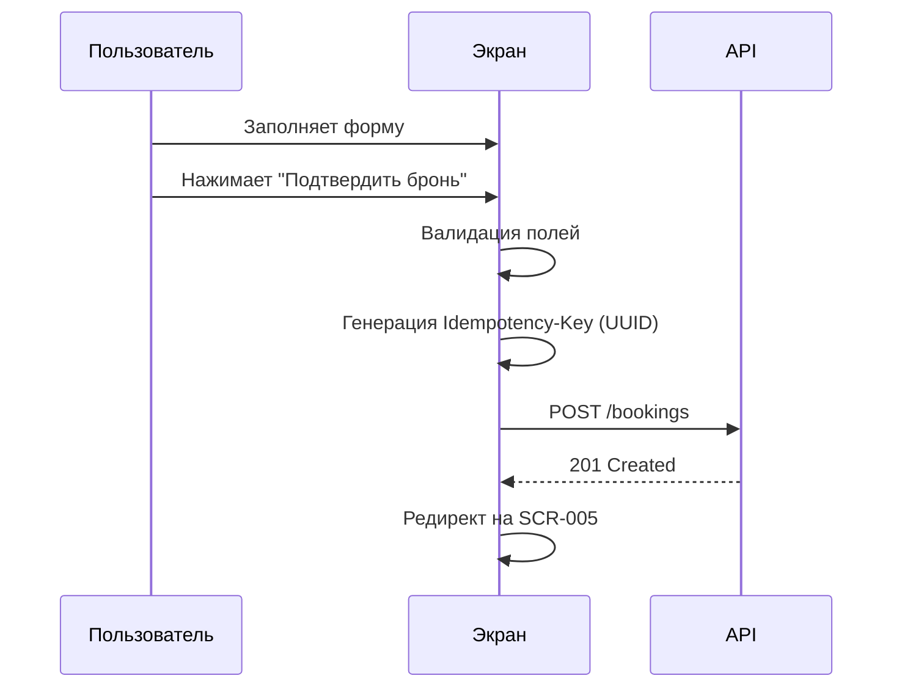
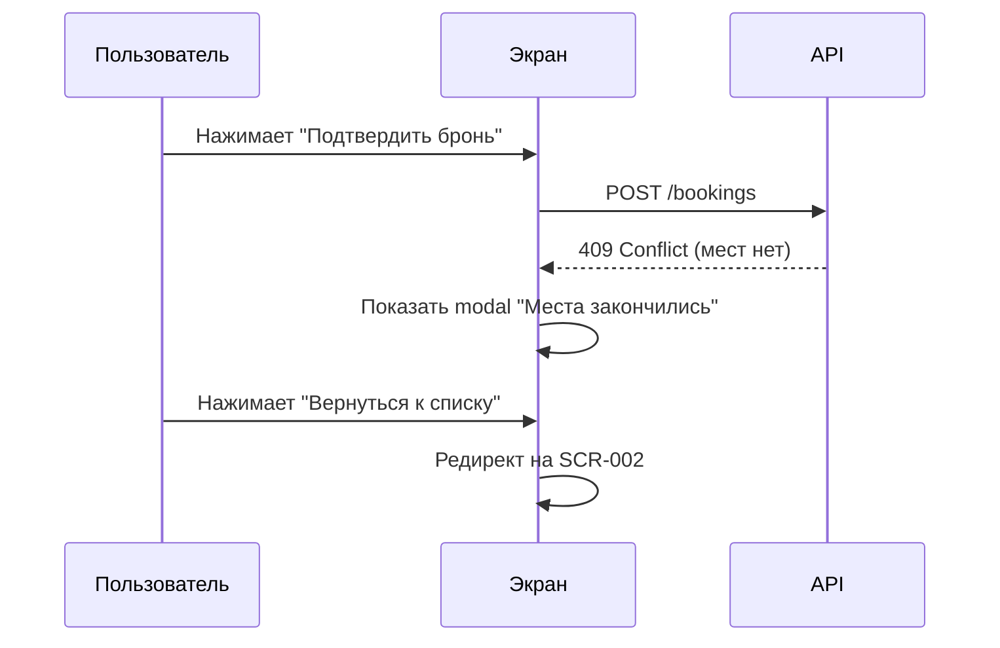

# 5-desktop-app-spec/SCR-004-booking.md

# Форма бронирования

**ID:** SCR-004

**Тип:** Экран

**Домен:** 03. Бронирование

**Приоритет:** Critical

**Статус:** Актуален

**Зона авторизации:** АЗ

---

## Содержание

- [Обзор](#обзор)
- [Навигация](#навигация)
- [Входные данные](#входные-данные)
- [Применяемые логики](#применяемые-логики)
- [Макет экрана](#макет-экрана)
- [Элементы экрана](#элементы-экрана)
- [Состояния экрана](#состояния-экрана)
- [Действия пользователя](#действия-пользователя)
- [Связанные требования](#связанные-требования)
- [Критерии приёмки](#критерии-приёмки)

---

## Обзор

Экран для создания бронирования на кулинарный класс. Содержит форму с выбором количества мест, типа экипировки и обязательным полем аллергий. Автоматически рассчитывает итоговую стоимость с учётом скидки постоянного клиента.

### User Story

> Как клиент студии, я хочу быстро забронировать места на кулинарный класс, чтобы гарантировать участие.

### Бизнес-ценность

- Атомарное создание броней (0 двойных броней)
- Автоматический расчёт стоимости
- Обязательный сбор информации об аллергиях (PII)
- Применение скидки лояльности

---

## Навигация

### Вход на экран
- Кнопка "Записаться" на SCR-003

### Выход с экрана
- Кнопка "Назад" → SCR-003
- Кнопка "Подтвердить бронь" → SCR-005 (Подтверждение)

---

## Входные данные

| Название | Тип | Возможные значения | Описание |
|----------|-----|-------------------|----------|
| `slot_id` | URL параметр | UUID | ID слота |

---

## Применяемые логики

| Логика | Элемент/Триггер | Описание |
|--------|-----------------|----------|
| BS-004 | При наличии блокировки | Баннер блокировки |
| BS-005 | При потере связи | Офлайн-режим (запрет мутаций) |

---

## Макет экрана

### Структура

**Область 1: Шапка**
| Позиция | Элемент | Описание |
|---------|---------|----------|
| Левая часть | Кнопка «Назад» ← | Возврат к деталям |
| Центр | Заголовок | «Бронирование» |
| Подзаголовок | Информация о слоте | «Итальянская кухня • Суббота, 10 июля, 15:00» |

**Область 2: Поле «Количество мест»**
| Позиция | Элемент | Описание |
|---------|---------|----------|
| Label | «Количество мест*» | Обязательное поле |
| Input | Числовое поле | Мин: 1, Макс: свободные места |
| Подсказка | «Доступно 5 мест» | Динамическая |

**Область 3: Выбор экипировки**
| Позиция | Элемент | Описание |
|---------|---------|----------|
| Label | «Экипировка» | — |
| Radio 1 | «○ Своя экипировка (бесплатно)» | По умолчанию |
| Radio 2 | «○ Прокат (фартук + ножи) (+500 ₽)» | Доплата |

**Область 4: Поле «Аллергии»**
| Позиция | Элемент | Описание |
|---------|---------|----------|
| Label | «Аллергии и особенности питания*» | Обязательное |
| Textarea | Многострочное поле | Placeholder: «Например: не переношу орехи, вегетарианец» |
| Подсказка | «Можно указать "Нет / не беспокоят"» | — |

**Область 5: Блок «Итого»**
| Позиция | Элемент | Описание |
|---------|---------|----------|
| Строка 1 | «Базовая стоимость: 5 000 ₽ × 2 = 10 000 ₽» | Расчёт |
| Строка 2 | «Прокат экипировки: +500 ₽» | Если выбран |
| Строка 3 | «Скидка постоянного клиента: −500 ₽ (5%)» | Если >5 посещений |
| Разделитель | Линия | — |
| Итого | «Итого: 10 000 ₽» | Жирный |
| Подпись | «Оплата на месте (наличные / перевод на карту)» | Статичная |

**Область 6: Кнопка действия**
| Позиция | Элемент | Описание |
|---------|---------|----------|
| Низ экрана | Кнопка «Подтвердить бронь» | Primary button (неактивна без аллергий) |

### Компоненты

| Компонент | Описание | Обязательность |
|-----------|----------|----------------|
| Header | Шапка с кнопкой «Назад» и информацией о слоте | Да |
| Guest Count Input | Поле выбора количества мест | Да |
| Equipment Radio | Радио-кнопки выбора экипировки | Да |
| Allergies Textarea | Текстовое поле аллергий (обязательное) | Да |
| Price Summary | Блок с расчётом стоимости | Да |
| CTA Button | Кнопка «Подтвердить бронь» | Да |

---

## Элементы экрана

### 1. Header

| Элемент | Описание | Источник данных | Валидация | Действие |
|---------|----------|-----------------|-----------|----------|
| Кнопка "Назад" | Возврат к деталям | — | — | Переход на SCR-003 |
| Заголовок | "Бронирование" | Статичный | — | — |
| Информация о слоте | "Итальянская кухня • Суббота, 10 июля, 15:00" | `program.name`, `datetime_from` из GET /slots | — | — |

### 2. Форма бронирования

| Элемент | Описание | Источник данных | Валидация | Действие |
|---------|----------|-----------------|-----------|----------|
| Поле "Количество мест" | Числовое поле (мин: 1, макс: свободные места) | Ввод пользователя | Целое число, 1 ≤ x ≤ `capacity_left`. Ошибка: "Неверное количество мест" | Пересчёт стоимости |
| Радио "Своя экипировка" | Выбор бесплатной экипировки | Ввод пользователя | — | Пересчёт стоимости (−500 ₽) |
| Радио "Прокат" | Выбор проката (+500 ₽) | Ввод пользователя | — | Пересчёт стоимости (+500 ₽) |
| Текстовое поле "Аллергии" | Многострочное поле (обязательное) | Ввод пользователя | Не может быть пустым. Ошибка: "Укажите аллергии или 'Нет / не беспокоят'" | — |

**Момент валидации:** При потере фокуса + при отправке формы

**Логика:**
- При изменении количества мест → пересчёт стоимости
- При переключении экипировки → пересчёт стоимости
- Кнопка "Подтвердить бронь" неактивна, пока поле "Аллергии" пустое

### 3. Блок "Итого"

| Элемент | Описание | Источник данных | Валидация | Действие |
|---------|----------|-----------------|-----------|----------|
| Базовая стоимость | "`price_base` × `guest_count`" | Расчёт | — | — |
| Прокат экипировки | "+500 ₽" (если выбран) | Расчёт | — | — |
| Скидка постоянного клиента | "−5%" (если `visit_count > 5`) | `client.visit_count` из кэша | — | — |
| Итого | Финальная сумма | Расчёт | — | — |
| Подпись | "Оплата на месте (наличные / перевод на карту)" | Статичная | — | — |

### 4. CTA

| Элемент | Описание | Источник данных | Валидация | Действие |
|---------|----------|-----------------|-----------|----------|
| Кнопка "Подтвердить бронь" | Primary button | — | — | POST /bookings |

**Условия доступности:**
- Кнопка активна, если: все обязательные поля заполнены И валидация пройдена

---

## Состояния экрана

### 1. Пустое поле аллергий
- Кнопка "Подтвердить бронь" неактивна
- При попытке отправки → inline ошибка: "Укажите аллергии или 'Нет / не беспокоят'"

### 2. Клиент заблокирован
- Баннер сверху: "Записи недоступны до <дата>"
- Подтекст: "Блокировка наложена из-за поздней отмены"
- Все поля неактивны (`disabled`)
- Кнопка "Подтвердить бронь" неактивна

### 3. Нет мест (гонка)
- Modal: "Места закончились"
- Текст: "К сожалению, пока вы заполняли форму, места заняли. Выберите другой слот."
- Кнопка: "Вернуться к списку" (редирект на SCR-002)

### 4. Ошибка сети
- Toast: "Не удалось создать бронь. Проверьте подключение и повторите"
- Кнопка "Повторить" (с тем же Idempotency-Key)

### 5. Успешное создание брони
- Редирект на SCR-005 (Подтверждение)

---

## Действия пользователя

### Создание бронирования

### Обработка гонки за места

## Связанные требования

### Функциональные (FR)

| ID | Название | Приоритет |
|----|----------|-----------|
| FR-09 | Атомарное создание брони | Critical |
| FR-10 | Выбор экипировки | High |
| FR-11 | Выбор количества мест | Critical |
| FR-12 | Поле "Аллергии" обязательно (PII) | Critical |
| FR-13 | Бронь = клиент + гости | High |
| FR-14 | Расчёт итоговой стоимости | High |
| FR-15 | Подпись "Оплата на месте" | Medium |
| FR-16 | Скидка 5% для постоянных клиентов | Medium |
| FR-17 | Статус "Ожидает оплаты" | High |

### Нефункциональные (NFR)

| ID | Название | Приоритет |
|----|----------|-----------|
| NFR-2 | ≤ 3 экрана до подтверждения | Critical |
| NFR-5 | Idempotency-Key (UUID) | Critical |
| NFR-7 | Атомарность брони (0 двойных) | Critical |
| NFR-9 | Офлайн-режим (запрет мутаций) | High |
| NFR-11 | Минимум полей | High |
| NFR-19 | WCAG 2.1 AA | High |

## Критерии приёмки

| ID | Критерий |
|----|----------|
| AC-001 | **Дано** пользователь на SCR-003, **Когда** нажимает "Записаться", **Тогда** открывается SCR-004 с формой бронирования |
| AC-002 | **Дано** пользователь на SCR-004, **Когда** изменяет количество мест или экипировку, **Тогда** автоматически пересчитывается итоговая стоимость |
| AC-003 | **Дано** поле "Аллергии" пустое, **Когда** пользователь пытается отправить форму, **Тогда** кнопка неактивна и отображается ошибка |
| AC-004 | **Дано** клиент имеет >5 посещений, **Когда** открывается экран, **Тогда** автоматически применяется скидка 5% |
| AC-005 | **Дано** клиент заблокирован, **Когда** открывается экран, **Тогда** все поля неактивны и отображается баннер блокировки |
| AC-006 | **Дано** пользователь отправляет форму, **Когда** происходит таймаут или ошибка сети, **Тогда** повторная отправка использует тот же Idempotency-Key |
| AC-007 | **Дано** места закончились во время заполнения формы, **Когда** пользователь отправляет форму, **Тогда** отображается modal с ошибкой и редирект на SCR-002 |