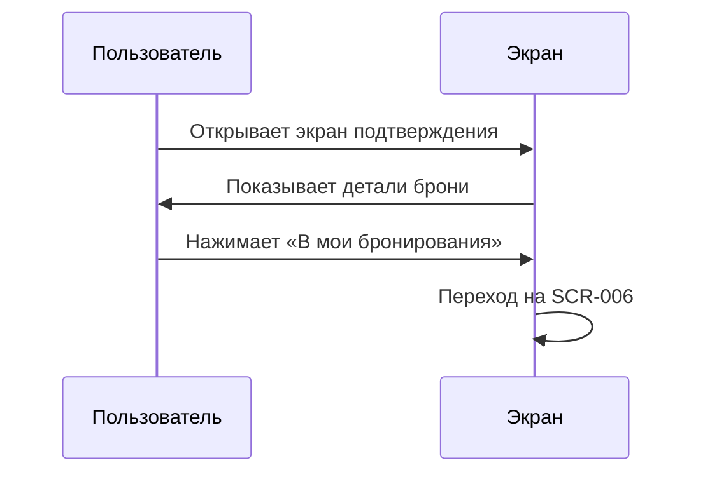

# 5-desktop-app-spec/SCR-005-confirmation.md

# Подтверждение брони

**ID:** SCR-005

**Тип:** Экран

**Домен:** 03. Бронирование

**Приоритет:** Critical

**Статус:** Актуален

**Зона авторизации:** АЗ

---

## Содержание

- [Обзор](#обзор)
- [Навигация](#навигация)
- [Входные данные](#входные-данные)
- [Макет экрана](#макет-экрана)
- [Элементы экрана](#элементы-экрана)
- [Состояния экрана](#состояния-экрана)
- [Действия пользователя](#действия-пользователя)
- [Связанные требования](#связанные-требования)
- [Критерии приёмки](#критерии-приёмки)

---

## Обзор

Экран подтверждения успешного создания бронирования. Отображает все детали брони и статус «Ожидает оплаты».

### User Story

> Как клиент студии, я хочу увидеть подтверждение моей брони, чтобы убедиться, что запись прошла успешно.

### Бизнес-ценность

- Подтверждение успешной операции
- Прозрачность деталей бронирования
- Снижение тревожности клиента

---

## Навигация

### Вход на экран
- После успешного создания брони (SCR-004)

### Выход с экрана
- Кнопка «В мои бронирования» → SCR-006
- Кнопка «На главную» → SCR-002

---

## Входные данные

| Название | Тип | Возможные значения | Описание |
|----------|-----|-------------------|----------|
| `booking_id` | State | UUID | ID созданной брони |

---

## Макет экрана

### Структура

**Область 1: Иконка успеха**
| Позиция | Элемент | Описание |
|---------|---------|----------|
| Центр | Иконка ✓ | Зелёная галочка (крупная) |

**Область 2: Заголовок**
| Позиция | Элемент | Описание |
|---------|---------|----------|
| Под иконкой | Заголовок | «Бронь подтверждена!» |

**Область 3: Детали брони**
| Позиция | Элемент | Описание |
|---------|---------|----------|
| Карточка | Программа | Название программы |
| Карточка | Дата и время | «Суббота, 10 июля, 15:00» |
| Карточка | Шеф | Имя и фамилия шефа |
| Карточка | Количество мест | Число мест |
| Карточка | Экипировка | «Прокат (фартук + ножи)» или «Своя» |
| Карточка | Аллергии | Указанные аллергии |

**Область 4: Стоимость**
| Позиция | Элемент | Описание |
|---------|---------|----------|
| Блок | Итого к оплате | Сумма в рублях |
| Подпись | Способ оплаты | «Оплата на месте (наличные / перевод на карту)» |

**Область 5: Статус**
| Позиция | Элемент | Описание |
|---------|---------|----------|
| Бейдж | Статус | «Ожидает оплаты» (серый) |

**Область 6: Кнопки действий**
| Позиция | Элемент | Описание |
|---------|---------|----------|
| Основная | «В мои бронирования» | Переход на SCR-006 |
| Вторичная | «На главную» | Переход на SCR-002 |

---

## Элементы экрана

### 1. Иконка успеха

| Элемент | Описание | Источник данных | Действие |
|---------|----------|-----------------|----------|
| Галочка ✓ | Зелёная иконка успеха | Статичная | — |

### 2. Детали брони

| Элемент | Описание | Источник данных |
|---------|----------|-----------------|
| Программа | Название программы | `booking.slot.program.name` |
| Дата и время | «Суббота, 10 июля, 15:00» | `booking.slot.datetime_from` |
| Шеф | Имя шефа | `booking.slot.chef.name` |
| Количество мест | Число гостей | `booking.guest_count` |
| Экипировка | Тип экипировки | `booking.equipment` |
| Аллергии | Информация об аллергиях | `booking.allergies` |

### 3. Стоимость

| Элемент | Описание | Источник данных |
|---------|----------|-----------------|
| Итого | Финальная сумма | `booking.price_final` |
| Подпись | Способ оплаты | Статичная |

### 4. Статус

| Элемент | Описание | Источник данных |
|---------|----------|-----------------|
| Бейдж | «Ожидает оплаты» | `booking.status` |

### 5. Кнопки действий

| Элемент | Описание | Действие |
|---------|----------|----------|
| «В мои бронирования» | Primary button | Переход на SCR-006 |
| «На главную» | Secondary button | Переход на SCR-002 |

---

## Состояния экрана

### 1. Успешное подтверждение
- Отображаются все детали брони
- Push-уведомление отправлено (если разрешено)

### 2. Ошибка загрузки деталей
- Сообщение: «Не удалось загрузить детали брони»
- Кнопка «В мои бронирования»

---

## Действия пользователя

## Связанные требования

### Функциональные (FR)

| ID | Название | Приоритет |
|----|----------|-----------|
| FR-17 | Статус «Ожидает оплаты» | High |
| FR-15 | Подпись «Оплата на месте» | Medium |

### Нефункциональные (NFR)

| ID | Название | Приоритет |
|----|----------|-----------|
| NFR-2 | ≤ 3 экрана до подтверждения | Critical |

## Критерии приёмки

| ID | Критерий |
|----|----------|
| AC-001 | **Дано** бронь успешно создана, **Когда** открывается экран подтверждения, **Тогда** отображаются все детали брони и статус «Ожидает оплаты» |
| AC-002 | **Дано** пользователь на экране подтверждения, **Когда** нажимает «В мои бронирования», **Тогда** происходит переход на SCR-006 |
| AC-003 | **Дано** пользователь на экране подтверждения, **Когда** нажимает «На главную», **Тогда** происходит переход на SCR-002 |