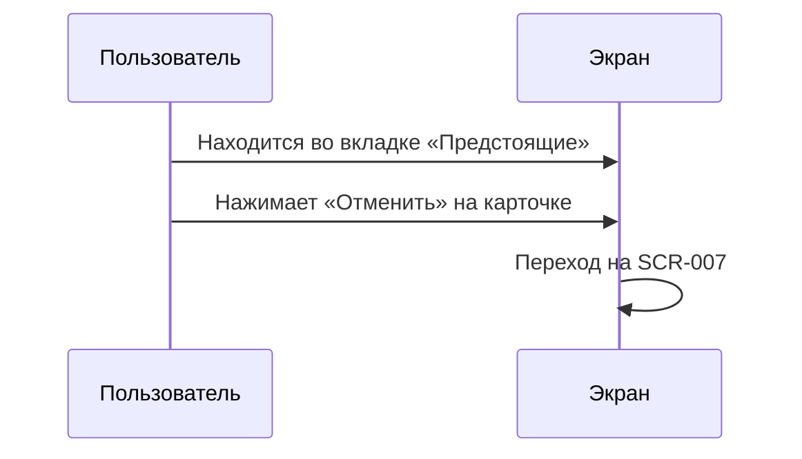
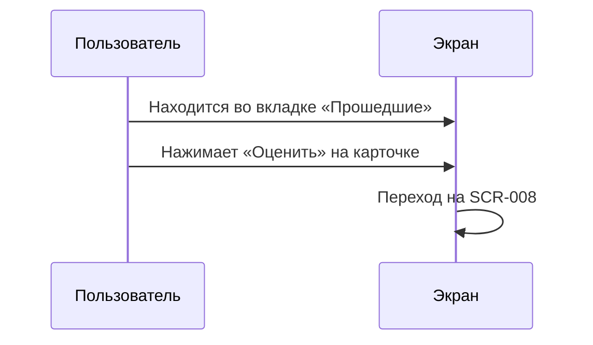

# 5-desktop-app-spec/SCR-006-my-bookings.md

# Мои бронирования

**ID:** SCR-006

**Тип:** Экран

**Домен:** 04. Управление бронированиями

**Приоритет:** High

**Статус:** Актуален

**Зона авторизации:** АЗ

---

## Содержание

- [Обзор](#обзор)
- [Навигация](#навигация)
- [Входные данные](#входные-данные)
- [Применяемые логики](#применяемые-логики)
- [Макет экрана](#макет-экрана)
- [Элементы экрана](#элементы-экрана)
- [Состояния экрана](#состояния-экрана)
- [Действия пользователя](#действия-пользователя)
- [Связанные требования](#связанные-требования)
- [Критерии приёмки](#критерии-приёмки)

---

## Обзор

Экран для просмотра и управления своими бронированиями. Содержит вкладки для фильтрации по статусу (Предстоящие, Прошедшие, Отменённые) и кнопки действий для каждой брони.

### User Story

> Как клиент студии, я хочу видеть все свои бронирования, чтобы управлять ими и отслеживать историю посещений.

### Бизнес-ценность

- Централизованное управление бронированиями
- Возможность отмены и оценки
- Прозрачность истории посещений

---

## Навигация

### Вход на экран
- Из SCR-005 (после подтверждения брони)
- Из SCR-009 (профиль)
- Из навигационного меню

### Выход с экрана
- Клик по карточке → детализация (опционально)
- Кнопка «Отменить» → SCR-007
- Кнопка «Оценить» → SCR-008

---

## Входные данные

| Название | Тип | Возможные значения | Описание |
|----------|-----|-------------------|----------|
| `status_group` | Query параметр | upcoming, past, cancelled | Вкладка/фильтр |

---

## Применяемые логики

| Логика | Элемент/Триггер | Описание |
|--------|-----------------|----------|
| BS-005 | При загрузке | Офлайн-режим (кэширование) |

---

## Макет экрана

### Структура

**Область 1: Заголовок**
| Позиция | Элемент | Описание |
|---------|---------|----------|
| Верх | Заголовок | «Мои бронирования» |

**Область 2: Вкладки/фильтры**
| Позиция | Элемент | Описание |
|---------|---------|----------|
| Под заголовком | Вкладка «Предстоящие» | По умолчанию активна |
| Под заголовком | Вкладка «Прошедшие» | — |
| Под заголовком | Вкладка «Отменённые» | — |

**Область 3: Список бронирований**
| Позиция | Элемент | Описание |
|---------|---------|----------|
| Карточка 1 | Бронь 1 | Детали + кнопки действий |
| Карточка 2 | Бронь 2 | Детали + кнопки действий |
| ... | ... | ... |

### Компоненты карточки брони

**Информация о брони:**
| Элемент | Описание |
|---------|----------|
| Дата и время | «Суббота, 10 июля, 15:00» |
| Название программы | «Итальянская кухня» |
| Шеф | «Иван Петров» |
| Статус (бейдж) | «Ожидает оплаты» / «Состоялся» / «Отменено» |
| Количество мест | «2 места» |
| Экипировка | «Прокат» / «Своя» |
| Аллергии | Кратко |

**Кнопки действий (зависят от статуса):**

| Статус | Кнопки |
|--------|--------|
| Предстоящие | «Отменить» (→ SCR-007) |
| Прошедшие (состоялся) | «Оценить» (→ SCR-008) или «Вы уже оценили» |
| Отменённые | Действий нет |

---

## Элементы экрана

### 1. Вкладки

| Элемент | Описание | Источник данных | Действие |
|---------|----------|-----------------|----------|
| «Предстоящие» | Вкладка upcoming | Query параметр | Фильтрация списка |
| «Прошедшие» | Вкладка past | Query параметр | Фильтрация списка |
| «Отменённые» | Вкладка cancelled | Query параметр | Фильтрация списка |

### 2. Карточка брони

| Элемент | Описание | Источник данных |
|---------|----------|-----------------|
| Дата и время | «Суббота, 10 июля, 15:00» | `booking.slot.datetime_from` |
| Программа | Название | `booking.slot.program.name` |
| Шеф | Имя | `booking.slot.chef.name` |
| Статус | Бейдж | `booking.status` |
| Места | Количество | `booking.guest_count` |
| Экипировка | Тип | `booking.equipment` |
| Аллергии | Текст | `booking.allergies` |

### 3. Кнопки действий

| Элемент | Описание | Условие отображения | Действие |
|---------|----------|---------------------|----------|
| «Отменить» | Secondary button | Статус = pending | Переход на SCR-007 |
| «Оценить» | Primary button | Статус = completed И оценка не поставлена | Переход на SCR-008 |
| «Вы уже оценили» | Текст | Статус = completed И оценка поставлена | — |

---

## Состояния экрана

### 1. Empty state (нет броней вообще)
- Иконка: пустой список
- Заголовок: «У вас пока нет бронирований»
- Текст: «Запишитесь на первый класс!»
- Кнопка: «Перейти к классам» (→ SCR-002)

### 2. Empty state (нет в категории)
- Пример: вкладка «Прошедшие» пуста
- Заголовок: «У вас пока нет прошедших классов»
- Кнопка: отсутствует

### 3. Загрузка
- Skeleton для карточек
- Длительность: p95 < 2.0 с (NFR-4)

### 4. Офлайн
- Данные из кэша
- Жёлтая плашка: «Данные могли устареть»

### 5. Ошибка загрузки
- Сообщение: «Не удалось загрузить бронирования»
- Кнопка: «Повторить»

---

## Действия пользователя

### Отмена брони

### Оценка шефа

## Связанные требования

### Функциональные (FR)

| ID | Название | Приоритет |
|----|----------|-----------|
| FR-18 | Мои бронирования (вкладки) | High |
| FR-19 | Отмена брони | High |
| FR-23 | Оценка шефа | Medium |

### Нефункциональные (NFR)

| ID | Название | Приоритет |
|----|----------|-----------|
| NFR-4 | Время загрузки p95 < 2.0 с | High |
| NFR-9 | Офлайн-режим | High |

## Критерии приёмки

| ID | Критерий |
|----|----------|
| AC-001 | **Дано** пользователь имеет бронирования, **Когда** открывает экран, **Тогда** отображается список с вкладками для фильтрации |
| AC-002 | **Дано** пользователь во вкладке «Предстоящие», **Когда** нажимает «Отменить», **Тогда** происходит переход на SCR-007 |
| AC-003 | **Дано** пользователь во вкладке «Прошедшие» с состоявшейся бронью, **Когда** нажимает «Оценить», **Тогда** происходит переход на SCR-008 |
| AC-004 | **Дано** у пользователя нет бронирований, **Когда** открывает экран, **Тогда** отображается empty state с кнопкой «Перейти к классам» |
| AC-005 | **Дано** оценка уже поставлена, **Когда** открывается вкладка «Прошедшие», **Тогда** отображается текст «Вы уже оценили» вместо кнопки |