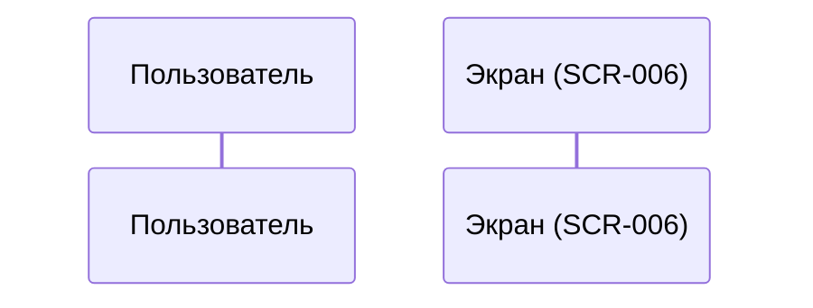

# 5-desktop-app-spec/SCR-007-cancel.md

# Отмена брони

**ID:** SCR-007

**Тип:** Модальное окно (Modal)

**Домен:** 04. Управление бронированиями

**Приоритет:** High

**Статус:** Актуален

**Зона авторизации:** АЗ

---

## Содержание

- [Обзор](#обзор)
- [Навигация](#навигация)
- [Входные данные](#входные-данные)
- [Применяемые логики](#применяемые-логики)
- [Макет экрана](#макет-экрана)
- [Элементы экрана](#элементы-экрана)
- [Состояния экрана](#состояния-экрана)
- [Действия пользователя](#действия-пользователя)
- [Связанные требования](#связанные-требования)
- [Критерии приёмки](#критерии-приёмки)

---

## Обзор

Модальное окно для подтверждения отмены предстоящей брони. Содержит предупреждение о возможных последствиях (блокировке аккаунта) при поздней отмене (менее чем за 12 часов до начала класса).

### User Story

> Как клиент студии, я хочу иметь возможность отменить бронь, чтобы освободить место, если мои планы изменились, и понимать последствия отмены.

### Бизнес-ценность

- Снижение no-show (неявок) за счёт предупреждения о блокировке.
- Прозрачность правил отмены для клиента.
- Освобождение мест для других клиентов при ранней отмене.

---

## Навигация

### Вход на экран
- Клик по кнопке «Отменить» на карточке предстоящей брони в SCR-006 (вкладка «Предстоящие»).

### Выход с экрана
- Клик по кнопке «Оставить бронь» → закрытие модалки, возврат в SCR-006.
- Клик по крестику (X) или клавиша `Esc` → закрытие модалки, возврат в SCR-006.
- Успешная отмена → закрытие модалки, обновление списка в SCR-006.

---

## Входные данные

| Название | Тип | Возможные значения | Описание |
|----------|-----|-------------------|----------|
| `booking_id` | URL/State параметр | UUID | ID отменяемой брони |

---

## Применяемые логики

| Логика | Элемент/Триггер | Описание |
|--------|-----------------|----------|
| BS-003 | Ошибка сети/сервера | Отображение ошибки внутри модалки |
| BS-004 | Поздняя отмена | Отображение предупреждения о блокировке на 7 дней |

---

## Макет экрана

### Структура

**Область 1: Шапка модалки**
| Позиция | Элемент | Описание |
|---------|---------|----------|
| Левая часть | Заголовок | «Отменить бронь?» |
| Правая часть | Кнопка закрытия (X) | Закрытие модалки без действий |

**Область 2: Детали брони**
| Позиция | Элемент | Описание |
|---------|---------|----------|
| Строка 1 | Название программы | Например: «Итальянская кухня» |
| Строка 2 | Дата и время | Например: «Суббота, 10 июля, 15:00» |

**Область 3: Текст предупреждения (зависит от времени до старта)**
| Позиция | Элемент | Описание |
|---------|---------|----------|
| Вариант 1 (Ранняя отмена, ≥12 ч) | Текст | «Вы уверены, что хотите отменить бронь? Место будет освобождено.» |
| Вариант 2 (Поздняя отмена, <12 ч) | Иконка | ⚠️ (предупреждение) |
| Вариант 2 (Поздняя отмена, <12 ч) | Заголовок | «Внимание!» |
| Вариант 2 (Поздняя отмена, <12 ч) | Текст | «Отмена менее чем за 12 часов приведёт к блокировке на 7 дней. Вы не сможете записываться на классы до <дата>.» |
| Вариант 2 (Поздняя отмена, <12 ч) | Фон блока | Жёлтый или светло-красный для акцента |

**Область 4: Кнопки действий**
| Позиция | Элемент | Описание |
|---------|---------|----------|
| Основная | «Отменить бронь» | Destructive button (красная) |
| Вторичная | «Оставить бронь» | Secondary button (серая/прозрачная) |

---

## Элементы экрана

### 1. Шапка и детали

| Элемент | Описание | Источник данных |
|---------|----------|-----------------|
| Заголовок | «Отменить бронь?» | Статичный |
| Программа | Название класса | `booking.slot.program.name` |
| Дата и время | Форматированная дата | `booking.slot.datetime_from` |

### 2. Блок предупреждения

| Элемент | Описание | Условие отображения |
|---------|----------|---------------------|
| Текст ранней отмены | «Вы уверены, что хотите отменить бронь? Место будет освобождено.» | `penalty = false` (≥12 часов до старта) |
| Иконка и заголовок | ⚠️ «Внимание!» | `penalty = true` (<12 часов до старта) |
| Текст поздней отмены | «Отмена менее чем за 12 часов приведёт к блокировке на 7 дней. Вы не сможете записываться на классы до <дата>.» | `penalty = true` (<12 часов до старта) |

### 3. Кнопки действий

| Элемент | Описание | Действие |
|---------|----------|----------|
| «Отменить бронь» | Красная кнопка (destructive) | Отправка `DELETE /bookings/{id}` |
| «Оставить бронь» | Вторичная кнопка | Закрытие модалки |

---

## Состояния экрана

### 1. Ранняя отмена (≥12 часов)
- Отображается стандартный текст подтверждения.
- Фон блока предупреждения нейтральный.

### 2. Поздняя отмена (<12 часов)
- Отображается иконка ️, заголовок «Внимание!» и текст о блокировке на 7 дней.
- Фон блока предупреждения выделен (жёлтый/красный).
- Дата разблокировки подставляется динамически.

### 3. Успешная отмена
- Модалка закрывается.
- Список бронирований в SCR-006 обновляется (бронь переходит в статус «Отменено клиентом» или скрывается из вкладки «Предстоящие»).
- Если отмена поздняя — отправляется push-уведомление о блокировке.

### 4. Ошибка отмены
- Модалка остаётся открытой.
- Появляется inline-ошибка или toast: «Не удалось отменить бронь. Попробуйте ещё раз».
- Кнопка «Отменить бронь» переходит в состояние `disabled` на время запроса (лоадер).

---

## Действия пользователя

### Сценарий отмены брони

## Связанные требования

### Функциональные (FR)

| ID | Название | Приоритет |
|----|----------|-----------|
| FR-19 | Отмена брони | High |
| FR-20 | Поздняя отмена → блокировка 7 дней | High |
| FR-21 | Ранняя отмена без блокировки | Medium |

### Нефункциональные (NFR)

| ID | Название | Приоритет |
|----|----------|-----------|
| NFR-19 | WCAG 2.1 AA (доступность модалки) | High |

## Критерии приёмки

| ID | Критерий |
|----|----------|
| AC-001 | **Дано** пользователь нажал «Отменить» на предстоящей брони, **Когда** открывается модалка, **Тогда** отображаются детали брони и текст предупреждения, соответствующий времени до старта |
| AC-002 | **Дано** до старта класса ≥12 часов, **Когда** открывается модалка, **Тогда** отображается текст «Вы уверены, что хотите отменить бронь? Место будет освобождено.» без предупреждения о блокировке |
| AC-003 | **Дано** до старта класса <12 часов, **Когда** открывается модалку, **Тогда** отображается блок «Внимание!» с текстом о блокировке на 7 дней и датой разблокировки |
| AC-004 | **Дано** пользователь нажал «Отменить бронь», **Когда** сервер вернул 200 OK, **Тогда** модалка закрывается, список в SCR-006 обновляется, и отображается уведомление об успехе |
| AC-005 | **Дано** произошла ошибка сети при отмене, **Когда** пользователь нажал «Отменить бронь», **Тогда** модалка остаётся открытой и отображается сообщение об ошибке с возможностью повторить действие |
| AC-006 | **Дано** модалка открыта, **Когда** пользователь нажимает `Esc` или кликает вне области модалки, **Тогда** модалка закрывается без отмены брони |