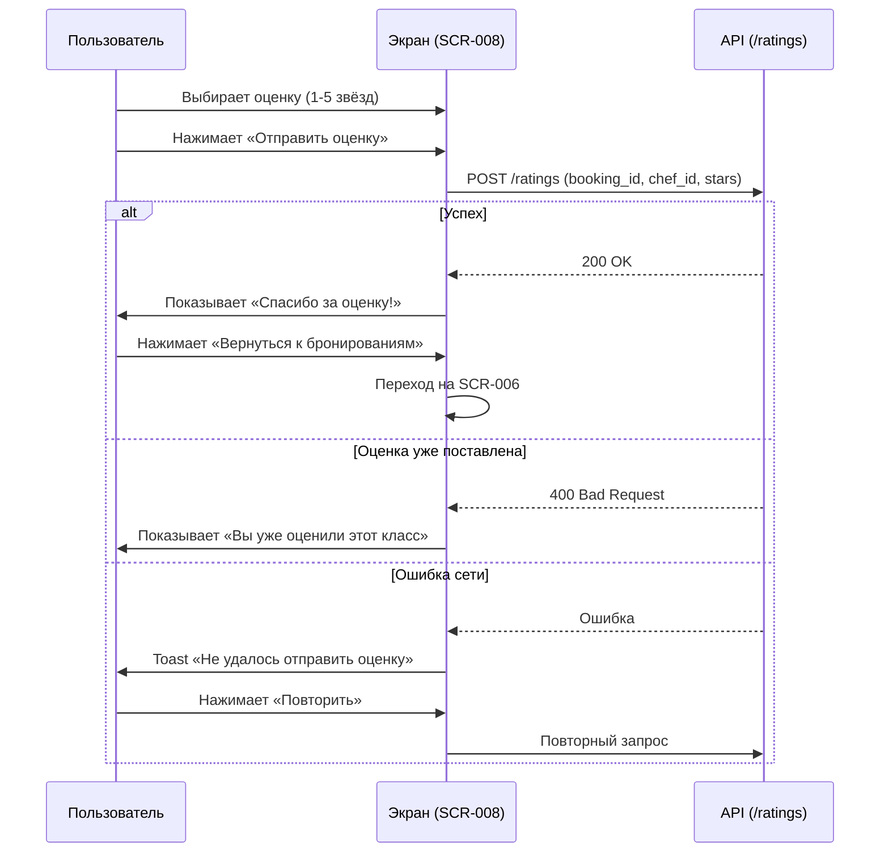

# 5-desktop-app-spec/SCR-008-rating.md
# Оценка шефа

**ID:** SCR-008

**Тип:** Экран

**Домен:** 04. Управление бронированиями

**Приоритет:** High

**Статус:** Актуален

**Зона авторизации:** АЗ

---

## Содержание

- [Обзор](#обзор)
- [Навигация](#навигация)
- [Входные данные](#входные-данные)
- [Применяемые логики](#применяемые-логики)
- [Макет экрана](#макет-экрана)
- [Элементы экрана](#элементы-экрана)
- [Состояния экрана](#состояния-экрана)
- [Действия пользователя](#действия-пользователя)
- [Связанные требования](#связанные-требования)
- [Критерии приёмки](#критерии-приёмки)

---

## Обзор

Экран для выставления оценки шеф-повару после посещения кулинарного класса. Клиент может поставить оценку от 1 до 5 звёзд. Текстовые комментарии в MVP не реализуются. Оценка доступна только один раз на бронь и только для классов со статусом «Состоялся».

### User Story

> Как клиент студии, я хочу оценить шефа после посещения класса, чтобы поделиться своим впечатлением и помочь другим клиентам с выбором.

### Бизнес-ценность

- Сбор обратной связи от клиентов.
- Формирование рейтинга шефа для отображения в карточках слотов.
- Повышение вовлечённости клиентов после посещения класса.

---

## Навигация

### Вход на экран
- Клик по кнопке «Оценить» на карточке прошедшей брони в SCR-006 (вкладка «Прошедшие», статус «Состоялся»).

### Выход с экрана
- Кнопка «Назад» → возврат в SCR-006.
- Успешная отправка оценки → экран подтверждения «Спасибо за оценку!» → кнопка «Вернуться к бронированиям» (SCR-006).

---

## Входные данные

| Название | Тип | Возможные значения | Описание |
|----------|-----|-------------------|----------|
| `booking_id` | URL/State параметр | UUID | ID брони, по которой ставится оценка |

---

## Применяемые логики

| Логика | Элемент/Триггер | Описание |
|--------|-----------------|----------|
| BS-003 | Ошибка сети/сервера | Отображение toast с ошибкой и кнопкой «Повторить» |

---

## Макет экрана

### Структура

**Область 1: Шапка**
| Позиция | Элемент | Описание |
|---------|---------|----------|
| Левая часть | Кнопка «Назад» ← | Возврат к списку бронирований |
| Центр | Заголовок | «Оцените шефа» |

**Область 2: Информация о классе**
| Позиция | Элемент | Описание |
|---------|---------|----------|
| Строка 1 | Название программы | Например: «Итальянская кухня» |
| Строка 2 | Дата и время | Например: «Суббота, 10 июля, 15:00» |
| Строка 3 | Имя шефа (крупно) | Например: «Иван Петров» |

**Область 3: Форма оценки**
| Позиция | Элемент | Описание |
|---------|---------|----------|
| Label | «Ваша оценка» | Текст над звёздами |
| Звёзды | 5 кликабельных звёзд | С hover-эффектом заполнения слева направо |
| Подпись под звёздами | Текущее значение | Например: «4 из 5» или «Выберите оценку от 1 до 5 звёзд» |

**Область 4: Кнопка действия**
| Позиция | Элемент | Описание |
|---------|---------|----------|
| Низ экрана | Кнопка «Отправить оценку» | Primary button (активна после выбора хотя бы 1 звезды) |

### Компоненты

| Компонент | Описание | Обязательность |
|-----------|----------|----------------|
| Header | Шапка с кнопкой «Назад» | Да |
| Class Info Block | Блок с информацией о классе и шефе | Да |
| Star Rating | Компонент выбора оценки (5 звёзд) | Да |
| CTA Button | Кнопка «Отправить оценку» | Да |

---

## Элементы экрана

### 1. Шапка

| Элемент | Описание | Источник данных | Действие |
|---------|----------|-----------------|----------|
| Кнопка «Назад» | Возврат к списку | — | Переход на SCR-006 |
| Заголовок | «Оцените шефа» | Статичный | — |

### 2. Информация о классе

| Элемент | Описание | Источник данных |
|---------|----------|-----------------|
| Название программы | «Итальянская кухня» | `booking.slot.program.name` |
| Дата и время | «Суббота, 10 июля, 15:00» | `booking.slot.datetime_from` |
| Имя шефа | «Иван Петров» | `booking.slot.chef.name` |

### 3. Форма оценки

| Элемент | Описание | Источник данных | Валидация | Действие |
|---------|----------|-----------------|-----------|----------|
| Label | «Ваша оценка» | Статичный | — | — |
| Звёзды (5 шт.) | Кликабельные звёзды | Ввод пользователя | Минимум 1 звезда | Hover: предпросмотр; Click: фиксация значения |
| Подпись | Текущее значение | Вычисляется из выбранных звёзд | — | Обновляется при выборе |

**Логика:**
- Звёзды заполняются слева направо.
- Hover: предпросмотр заполнения (например, при наведении на 4-ю звезду — заполняются 4 звезды).
- Click: фиксирует значение, подпись обновляется («4 из 5»).
- Кнопка «Отправить оценку» активна только при выборе ≥1 звезды.

### 4. Кнопка действия

| Элемент | Описание | Условие доступности | Действие |
|---------|----------|---------------------|----------|
| «Отправить оценку» | Primary button | Выбрана хотя бы 1 звезда | POST /ratings |

---

## Состояния экрана

### 1. Пустая форма (звёзды не выбраны)
- Звёзды серые (outline).
- Кнопка «Отправить оценку» неактивна (`disabled`).
- Подпись: «Выберите оценку от 1 до 5 звёзд».

### 2. Выбрана оценка (hover / click)
- Звёзды заполняются слева направо.
- Hover: предпросмотр заполнения.
- Click: фиксирует значение.
- Кнопка «Отправить оценку» активна.
- Подпись: «N из 5» (например, «4 из 5»).

### 3. Успешная отправка
- Отображается экран подтверждения: «Спасибо за оценку!»
- Кнопка: «Вернуться к бронированиям» (переход на SCR-006).
- Рейтинг шефа обновлён в карточках слотов (FR-24).

### 4. Оценка уже поставлена
- Заголовок: «Вы уже оценили этот класс».
- Отображаются поставленные звёзды (read-only, без возможности изменения).
- Кнопка отправки отсутствует.
- Кнопка: «Вернуться к бронированиям».

### 5. Класс не состоялся
- Форма оценки недоступна.
- Сообщение: «Оценка доступна только для состоявшихся классов».
- Кнопка: «Вернуться к бронированиям».

### 6. Ошибка отправки
- Toast: «Не удалось отправить оценку. Попробуйте ещё раз».
- Кнопка «Повторить» (повторная отправка с теми же данными).

---

## Действия пользователя

### Отправка оценки

## Связанные требования

### Функциональные (FR)

| ID | Название | Приоритет |
|----|----------|-----------|
| FR-23 | Оценка 1-5 звёзд, без текста | High |
| FR-24 | Пересчёт рейтинга шефа | High |

### Нефункциональные (NFR)

| ID | Название | Приоритет |
|----|----------|-----------|
| NFR-19 | WCAG 2.1 AA (доступность звёзд) | High |

## Критерии приёмки

| ID | Критерий |
|----|----------|
| AC-001 | **Дано** пользователь во вкладке «Прошедшие» с бронью в статусе «Состоялся», **Когда** нажимает «Оценить», **Тогда** открывается SCR-008 с формой оценки |
| AC-002 | **Дано** пользователь на SCR-008, **Когда** наводит курсор на звезду, **Тогда** звёзды заполняются слева направо до наведённой (предпросмотр) |
| AC-003 | **Дано** пользователь выбрал оценку, **Когда** нажимает «Отправить оценку», **Тогда** оценка отправляется на сервер и отображается экран подтверждения |
| AC-004 | **Дано** оценка уже была поставлена ранее, **Когда** открывается SCR-008, **Тогда** отображаются поставленные звёзды в режиме read-only и кнопка «Вернуться к бронированиям» |
| AC-005 | **Дано** класс не состоялся (статус ≠ «Состоялся»), **Когда** открывается SCR-008, **Тогда** отображается сообщение «Оценка доступна только для состоявшихся классов» |
| AC-006 | **Дано** произошла ошибка сети при отправке, **Когда** пользователь нажал «Отправить оценку», **Тогда** отображается toast с ошибкой и кнопкой «Повторить» |
| AC-007 | **Дано** пользователь использует клавиатуру, **Когда** нажимает Tab и стрелки, **Тогда** фокус перемещается между звёздами, и оценка выбирается с помощью клавиш |