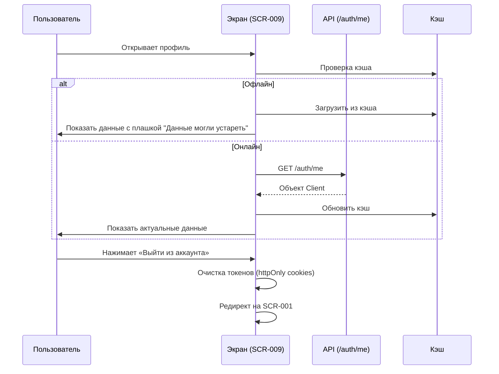

# 5-desktop-app-spec/SCR-009-profile.md

# Профиль клиента

**ID:** SCR-009

**Тип:** Экран

**Домен:** 05. Профиль и лояльность

**Приоритет:** High

**Статус:** Актуален

**Зона авторизации:** АЗ

---

## Содержание

- [Обзор](#обзор)
- [Навигация](#навигация)
- [Входные данные](#входные-данные)
- [Применяемые логики](#применяемые-логики)
- [Макет экрана](#макет-экрана)
- [Элементы экрана](#элементы-экрана)
- [Состояния экрана](#состояния-экрана)
- [Действия пользователя](#действия-пользователя)
- [Связанные требования](#связанные-требования)
- [Критерии приёмки](#критерии-приёмки)

---

## Обзор

Экран для просмотра личной информации клиента, отслеживания прогресса в программе лояльности и управления сессией. Отображает счётчик посещений, статус «Постоянный клиент» и информацию о блокировке (если применима).

### User Story

> Как клиент студии, я хочу видеть свой профиль и количество посещённых классов, чтобы понимать, когда мне будет доступна скидка постоянного клиента, и узнавать о статусе моей блокировки (если она есть).

### Бизнес-ценность

- Прозрачность программы лояльности (мотивация к повторным посещениям).
- Информирование клиента о блокировке и её причине.
- Безопасный выход из аккаунта.

---

## Навигация

### Вход на экран
- Клик по иконке профиля в шапке (Header) на любом экране.
- Из меню навигации.

### Выход с экрана
- Кнопка «Мои бронирования» → SCR-006.
- Кнопка «Выйти из аккаунта» → SCR-001 (с очисткой токенов).
- Клик по логотипу или кнопке «На главную» → SCR-002.

---

## Входные данные

| Название | Тип | Возможные значения | Описание |
|----------|-----|-------------------|----------|
| `client` | State / API | Объект `Client` | Данные текущего пользователя из GET /auth/me или кэша |

---

## Применяемые логики

| Логика | Элемент/Триггер | Описание |
|--------|-----------------|----------|
| BS-004 | Блок уведомлений | Отображение баннера блокировки при `is_blocked = true` |
| BS-005 | При загрузке | Офлайн-режим (отображение из кэша) |

---

## Макет экрана

### Структура

**Область 1: Шапка профиля**
| Позиция | Элемент | Описание |
|---------|---------|----------|
| Верх | Заголовок | «Мой профиль» |
| Центр | Аватар / Инициалы | Круглая иконка или первые буквы имени |
| Под аватаром | Имя и Email | Например: «Иван Петров» / «ivan@example.com» (read-only) |

**Область 2: Блок лояльности**
| Позиция | Элемент | Описание |
|---------|---------|----------|
| Карточка | Счётчик посещений | «Вы посетили N классов» |
| Карточка | Бейдж «Постоянный клиент» | Отображается только при N > 5 (выделен цветом/иконкой) |
| Подпись под бейджем | Текст | «Скидка 5% на все классы» |

**Область 3: Блок уведомлений о блокировке (условный)**
| Позиция | Элемент | Описание |
|---------|---------|----------|
| Баннер (жёлтый/красный) | Иконка ⚠️ | Предупреждение |
| Баннер | Текст | «Записи недоступны до <дата>» |
| Баннер | Причина | «Поздняя отмена» или «Неявка на класс» |

**Область 4: Кнопки действий**
| Позиция | Элемент | Описание |
|---------|---------|----------|
| Основная | «Мои бронирования» | Переход на SCR-006 |
| Вторичная (деструктивная) | «Выйти из аккаунта» | Очистка токенов, редирект на SCR-001 |

### Компоненты

| Компонент | Описание | Обязательность |
|-----------|----------|----------------|
| Profile Header | Аватар, имя, email | Да |
| Loyalty Card | Счётчик и бейдж | Да |
| Block Banner | Баннер блокировки | Условно (только при `is_blocked`) |
| Action Buttons | Кнопки навигации и выхода | Да |

---

## Элементы экрана

### 1. Шапка профиля

| Элемент | Описание | Источник данных | Действие |
|---------|----------|-----------------|----------|
| Аватар / Инициалы | Визуальное представление | `client.first_name`, `client.last_name` | — |
| Имя | Полное имя | `client.first_name` + `client.last_name` | — |
| Email | Адрес почты | `client.email` | — |

### 2. Блок лояльности

| Элемент | Описание | Источник данных | Условие отображения |
|---------|----------|-----------------|---------------------|
| Счётчик | «Вы посетили N классов» | `client.visit_count` | Всегда |
| Бейдж | «Постоянный клиент» | Статичный текст + иконка | `client.visit_count > 5` |
| Подпись | «Скидка 5% на все классы» | Статичный текст | `client.visit_count > 5` |

### 3. Блок уведомлений о блокировке

| Элемент | Описание | Источник данных | Условие отображения |
|---------|----------|-----------------|---------------------|
| Баннер | Жёлтый/красный фон, иконка ⚠️ | Статичный | `client.is_blocked = true` |
| Текст даты | «Записи недоступны до <дата>» | `client.blocked_until` | `client.is_blocked = true` |
| Причина | «Поздняя отмена» / «Неявка» | Статичный / API | `client.is_blocked = true` |

### 4. Кнопки действий

| Элемент | Описание | Действие |
|---------|----------|----------|
| «Мои бронирования» | Secondary button | Переход на SCR-006 |
| «Выйти из аккаунта» | Text button / Ghost button | Очистка httpOnly cookies, редирект на SCR-001 |

---

## Состояния экрана

### 1. Обычный клиент (≤ 5 посещений)
- Счётчик: «Вы посетили 3 класса».
- Бейдж «Постоянный клиент» и подпись о скидке **не отображаются**.
- Скидка 5% не применяется при бронировании.

### 2. Постоянный клиент (> 5 посещений)
- Счётчик: «Вы посетили 7 классов».
- Бейдж «Постоянный клиент» отображается (выделен цветом/иконкой).
- Подпись: «Скидка 5% на все классы».
- Скидка применяется автоматически при бронировании (FR-16).

### 3. Клиент заблокирован
- Баннер сверху (жёлтый/красный фон): «Записи недоступны до <дата>».
- Причина: «Поздняя отмена» или «Неявка на класс».
- Счётчик посещений и бейдж остаются видимыми.
- Кнопка «Мои бронирования» активна (просмотр разрешён).
- *Примечание:* Все кнопки бронирования на других экранах (SCR-002, SCR-003, SCR-004) переходят в состояние `disabled` (FR-30).

### 4. Загрузка профиля
- Skeleton-экран для счётчика, бейджа и имени.
- Длительность: p95 < 2.0 с (NFR-4).

### 5. Ошибка загрузки
- Сообщение: «Не удалось загрузить профиль».
- Кнопка: «Повторить».

---

## Действия пользователя

### Просмотр профиля и выход из аккаунта

## Связанные требования

### Функциональные (FR)

| ID | Название | Приоритет |
|----|----------|-----------|
| FR-03 | Счётчик посещений | High |
| FR-04 | Бейдж «Постоянный клиент» | Medium |
| FR-29 | Блокировка на 7 дней | Critical |
| FR-30 | Блокировка кнопок «Записаться» | Critical |

### Нефункциональные (NFR)

| ID | Название | Приоритет |
|----|----------|-----------|
| NFR-4 | Время загрузки p95 < 2.0 с | High |
| NFR-19 | WCAG 2.1 AA (доступность) | High |

## Критерии приёмки

| ID | Критерий |
|----|----------|
| AC-001 | **Дано** пользователь имеет ≤ 5 посещений, **Когда** открывается экран профиля, **Тогда** отображается счётчик посещений, но бейдж «Постоянный клиент» скрыт |
| AC-002 | **Дано** пользователь имеет > 5 посещений, **Когда** открывается экран профиля, **Тогда** отображается бейдж «Постоянный клиент» с подписью «Скидка 5% на все классы» |
| AC-003 | **Дано** клиент заблокирован, **Когда** открывается экран профиля, **Тогда** отображается баннер с датой разблокировки и причиной, а счётчик и бейдж остаются видимыми |
| AC-004 | **Дано** пользователь на экране профиля, **Когда** нажимает «Выйти из аккаунта», **Тогда** сессия очищается и происходит редирект на SCR-001 |
| AC-005 | **Дано** произошла ошибка сети при загрузке, **Когда** открывается экран профиля, **Тогда** отображается сообщение об ошибке и кнопка «Повторить» |
| AC-006 | **Дано** пользователь использует клавиатуру, **Когда** перемещается по экрану, **Тогда** все кнопки и интерактивные элементы доступны через Tab и имеют видимый focus-состояние |