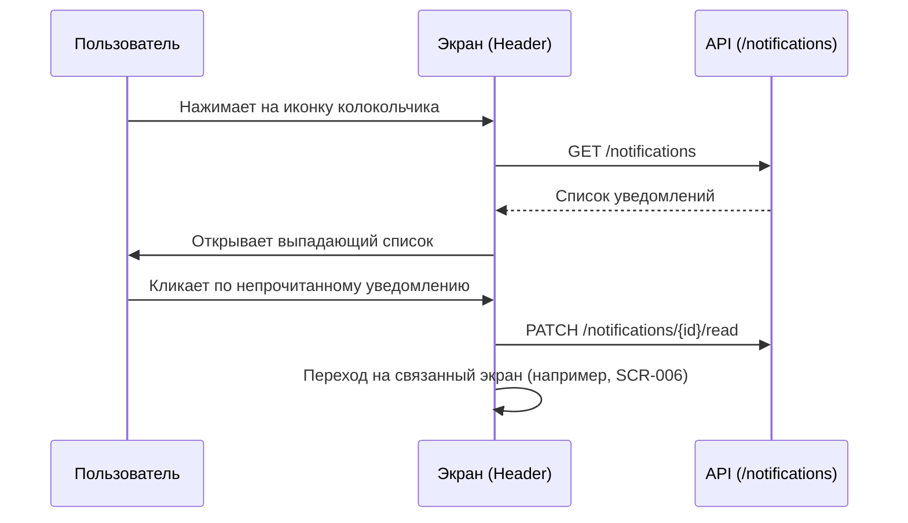
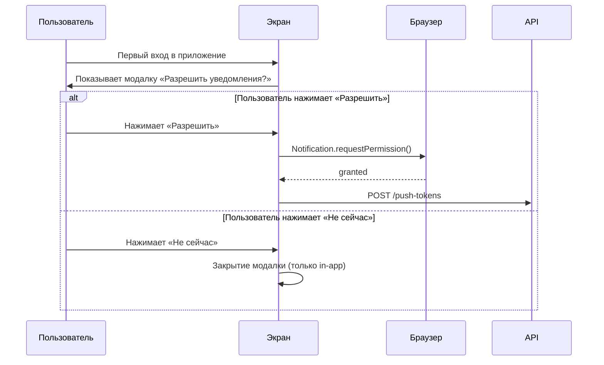

# 5-desktop-app-spec/SCR-009-notifications.md

# Уведомления (Колокольчик)

**ID:** SCR-010

**Тип:** Компонент / Выпадающий список (Dropdown)

**Домен:** 06. Уведомления

**Приоритет:** High

**Статус:** Актуален

**Зона авторизации:** АЗ

---

## Содержание

- [Обзор](#обзор)
- [Навигация](#навигация)
- [Входные данные](#входные-данные)
- [Применяемые логики](#применяемые-логики)
- [Макет экрана](#макет-экрана)
- [Элементы экрана](#элементы-экрана)
- [Состояния экрана](#состояния-экрана)
- [Действия пользователя](#действия-пользователя)
- [Связанные требования](#связанные-требования)
- [Критерии приёмки](#критерии-приёмки)

---

## Обзор

Компонент in-app уведомлений в виде выпадающего списка, который открывается по клику на иконку колокольчика в шапке приложения. Бейдж непрочитанных отображается на самой иконке. В MVP используются только Web Push API и in-app уведомления (SMS/Email вне скоупа).

### User Story

> Как клиент студии, я хочу видеть список уведомлений и получать push-напоминания, чтобы не пропустить кулинарный класс и быть в курсе изменений по моим бронированиям.

### Бизнес-ценность

- Снижение no-show (неявок) за счёт напоминаний за 24 часа.
- Оперативное информирование об отменах студией и блокировках аккаунта.
- Повышение вовлечённости и прозрачности коммуникации.

---

## Навигация

### Вход на экран
- Клик по иконке колокольчика в Header (на любом авторизованном экране).
- Автоматический показ модалки запроса разрешения на Push при первом входе или первой попытке бронирования.

### Выход с экрана
- Клик вне области выпадающего списка.
- Нажатие клавиши `Esc`.
- Клик по карточке уведомления → переход на связанный экран (SCR-006, SCR-003 и т.д.).

---

## Входные данные

| Название | Тип | Возможные значения | Описание |
|----------|-----|-------------------|----------|
| `notifications` | State / API | Массив объектов | Список уведомлений текущего пользователя |
| `unread_count` | State / API | integer ≥ 0 | Количество непрочитанных уведомлений |

---

## Применяемые логики

| Логика | Элемент/Триггер | Описание |
|--------|-----------------|----------|
| BS-003 | Ошибка сети | Отображение Error state внутри списка |
| BS-004 | Уведомление о блокировке | Отображение карточки с важным приоритетом |
| NFR-15 | Системный запрос Push | Регистрация токена после получения разрешения |

---

## Макет экрана

### Структура

**Область 1: Иконка колокольчика (в Header)**
| Позиция | Элемент | Описание |
|---------|---------|----------|
| Правая часть шапки | Иконка колокольчика | Рядом с иконкой профиля |
| Правый верхний угол иконки | Бейдж непрочитанных | Красная точка или число (например, «3») |
| При наведении (Hover) | Tooltip | Текст «Уведомления» |

**Область 2: Шапка выпадающего списка**
| Позиция | Элемент | Описание |
|---------|---------|----------|
| Верх списка | Заголовок | «Уведомления» |
| Под заголовком (справа) | Ссылка | «Отметить все как прочитанные» (видна только если есть непрочитанные) |

**Область 3: Список уведомлений**
| Позиция | Элемент | Описание |
|---------|---------|----------|
| Карточка 1 | Уведомление 1 | Иконка, заголовок, текст, время, статус |
| Карточка 2 | Уведомление 2 | Иконка, заголовок, текст, время, статус |
| ... | ... | Сортировка: новые сверху |

**Область 4: Empty state (если список пуст)**
| Позиция | Элемент | Описание |
|---------|---------|----------|
| Центр списка | Иконка | Серый колокольчик |
| Под иконкой | Заголовок | «Нет новых уведомлений» |
| Под заголовком | Подтекст | «Здесь будут появляться важные события» |

### Компоненты

| Компонент | Описание | Обязательность |
|-----------|----------|----------------|
| Bell Icon | Иконка колокольчика с бейджем | Да |
| Dropdown Panel | Выпадающая панель со списком | Да |
| Notification Card | Карточка отдельного уведомления | Да |
| Push Permission Modal | Модалка запроса разрешения на Push | Да |

---

## Элементы экрана

### 1. Иконка колокольчика

| Элемент | Описание | Источник данных | Действие |
|---------|----------|-----------------|----------|
| Иконка | SVG колокольчика | Статичная | Открытие выпадающего списка |
| Бейдж | Число или точка | `unread_count` | — |
| Tooltip | «Уведомления» | Статичный | — |

### 2. Шапка выпадающего списка

| Элемент | Описание | Источник данных | Условие отображения |
|---------|----------|-----------------|---------------------|
| Заголовок | «Уведомления» | Статичный | Всегда |
| Ссылка | «Отметить все как прочитанные» | — | `unread_count > 0` |

### 3. Карточка уведомления

| Элемент | Описание | Источник данных | Валидация | Действие |
|---------|----------|-----------------|-----------|----------|
| Иконка типа | Иконка события (бронь, отмена, блокировка) | `notification.type` | — | — |
| Заголовок | Краткий заголовок (например, «Напоминание о классе») | `notification.title` | — | — |
| Текст | Описание (1–2 строки) | `notification.text` | — | — |
| Время | Относительное время («2 часа назад», «Вчера») | `notification.created_at` | — | — |
| Статус | Жирный текст / выделенный фон | `notification.is_read` | — | Переход на связанный экран + пометка как прочитанное |

### 4. Модалка запроса разрешения на Push

| Элемент | Описание | Действие |
|---------|----------|----------|
| Заголовок | «Разрешить уведомления?» | — |
| Текст | «Мы будем напоминать о классах и важных изменениях» | — |
| Кнопка «Разрешить» | Primary button | Запрос системного разрешения → регистрация токена |
| Кнопка «Не сейчас» | Secondary button | Закрытие модалки, работа только in-app |

---

## Состояния экрана

### 1. Есть непрочитанные уведомления
- Бейдж на колокольчике отображает число (например, «3»).
- Непрочитанные карточки в списке выделены (жирный текст / светлый фон).
- Ссылка «Отметить все как прочитанные» видна.

### 2. Все уведомления прочитаны
- Бейдж на колокольчике скрыт.
- Все карточки в обычном состоянии.
- Ссылка «Отметить все как прочитанные» скрыта.

### 3. Empty state (нет уведомлений)
- Иконка серого колокольчика.
- Заголовок: «Нет новых уведомлений».
- Подтекст: «Здесь будут появляться важные события».

### 4. Загрузка списка
- Skeleton для 3–4 карточек внутри выпадающего списка.
- Длительность: p95 < 2.0 с (NFR-4).

### 5. Ошибка загрузки
- Текст: «Не удалось загрузить уведомления».
- Кнопка: «Повторить».

### 6. Запрос разрешения на Push (FR-27)
- Модалка поверх основного контента при первом входе или первом бронировании.
- При отказе — уведомления работают только in-app (колокольчик).

---

## Действия пользователя

### Открытие списка и прочтение уведомлений

### Запрос разрешения на Push-уведомления

## Связанные требования

### Функциональные (FR)

| ID | Название | Приоритет |
|----|----------|-----------|
| FR-25 | Напоминание за ~24 часа до старта | High |
| FR-26 | Push при отмене класса студией | High |
| FR-27 | Запрос разрешения на push | Medium |
| FR-28 | Бейдж непрочитанных на колокольчике | High |

### Нефункциональные (NFR)

| ID | Название | Приоритет |
|----|----------|-----------|
| NFR-4 | Время загрузки p95 < 2.0 с | High |
| NFR-15 | Push-токен регистрируется после разрешения | High |
| NFR-16 | Только Web Push + in-app (без SMS/Email) | Critical |
| NFR-19 | WCAG 2.1 AA (доступность) | High |

## Критерии приёмки

| ID | Критерий |
|----|----------|
| AC-001 | **Дано** у пользователя есть непрочитанные уведомления, **Когда** открывается шапка приложения, **Тогда** на иконке колокольчика отображается бейдж с количеством непрочитанных |
| AC-002 | **Дано** пользователь кликнул по колокольчику, **Когда** открывается выпадающий список, **Тогда** уведомления отсортированы по времени (новые сверху), непрочитанные выделены визуально |
| AC-003 | **Дано** пользователь кликнул по непрочитанному уведомлению, **Когда** происходит переход на связанный экран, **Тогда** уведомление помечается как прочитанное, бейдж уменьшается |
| AC-004 | **Дано** у пользователя нет уведомлений, **Когда** он открывает выпадающий список, **Тогда** отображается empty state с текстом «Нет новых уведомлений» |
| AC-005 | **Дано** пользователь заходит в приложение впервые, **Когда** загружается главная страница, **Тогда** отображается модалка с запросом разрешения на Push-уведомления |
| AC-006 | **Дано** пользователь отказался от Push-уведомлений, **Когда** происходит важное событие (например, отмена класса), **Тогда** уведомление отображается только в колокольчике (in-app) |
| AC-007 | **Дано** пользователь использует клавиатуру, **Когда** открывает список уведомлений, **Тогда** он может перемещаться по карточкам с помощью Tab/стрелок и закрыть список по Esc |
