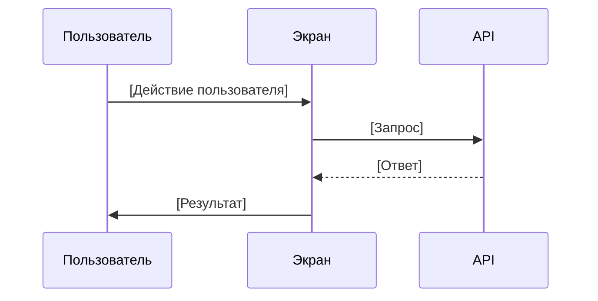

# _SCREEN_TEMPLATE.md

# [Название экрана]

**ID:** SCR-XXX

**Тип:** Экран / Модальное окно / Компонент

**Домен:** [Номер и название домена]

**Приоритет:** Critical / High / Medium / Low

**Статус:** Актуален / В работе / Черновик

**Зона авторизации:** НЗ (неавторизованная) / АЗ (авторизованная) / Обе

---

## Содержание

- [Обзор](#обзор)
- [Навигация](#навигация)
- [Входные данные](#входные-данные)
- [Применяемые логики](#применяемые-логики)
- [Макет экрана](#макет-экрана)
- [Элементы экрана](#элементы-экрана)
- [Состояния экрана](#состояния-экрана)
- [Действия пользователя](#действия-пользователя)
- [Связанные требования](#связанные-требования)
- [Критерии приёмки](#критерии-приёмки)

---

## Обзор

[Краткое описание экрана и его назначения]

### User Story

> Как [роль пользователя], я хочу [действие], чтобы [ценность/результат].

### Бизнес-ценность

- [Пункт 1]
- [Пункт 2]
- [Пункт 3]

---

## Навигация

### Вход на экран
- [Способ 1: откуда и при каком условии]
- [Способ 2: откуда и при каком условии]

### Выход с экрана
- [Действие 1] → [Куда переходит]
- [Действие 2] → [Куда переходит]

---

## Входные данные

| Название | Тип | Возможные значения | Описание |
|----------|-----|-------------------|----------|
| [параметр 1] | [URL параметр / Query параметр / State] | [тип данных] | [описание] |
| [параметр 2] | [тип] | [значения] | [описание] |

---

## Применяемые логики

| Логика | Элемент/Триггер | Описание |
|--------|-----------------|----------|
| [BS-XXX] | [элемент или действие] | [что делает] |
| [BS-XXX] | [элемент или действие] | [что делает] |

---

## Макет экрана

### Структура

**Область 1: [Название области]**
| Позиция | Элемент | Описание |
|---------|---------|----------|
| [позиция] | [название элемента] | [описание] |

**Область 2: [Название области]**
| Позиция | Элемент | Описание |
|---------|---------|----------|
| [позиция] | [название элемента] | [описание] |

### Компоненты

| Компонент | Описание | Обязательность |
|-----------|----------|----------------|
| [название] | [описание] | Да / Опционально |

---

## Элементы экрана

### 1. [Название группы элементов]

| Элемент | Описание | Источник данных | Валидация | Действие |
|---------|----------|-----------------|-----------|----------|
| [элемент] | [описание] | [откуда данные] | [правила] | [что делает] |

**Логика:**
- [Правило 1]
- [Правило 2]

### 2. [Название группы элементов]

| Элемент | Описание | Источник данных | Условие отображения |
|---------|----------|-----------------|---------------------|
| [элемент] | [описание] | [откуда данные] | [когда показывать] |

---

## Состояния экрана

### 1. [Название состояния]
- [Описание 1]
- [Описание 2]

### 2. [Название состояния]
- [Описание 1]
- [Описание 2]

### 3. [Название состояния]
- [Описание 1]
- [Описание 2]

---

## Действия пользователя

### [Название сценария]

## Связанные требования

### Функциональные (FR)

| ID | Название | Приоритет |
|----|----------|-----------|
| FR-XXX | [название] | [приоритет] |

### Нефункциональные (NFR)

| ID | Название | Приоритет |
|----|----------|-----------|
| NFR-XXX | [название] | [приоритет] |

## Критерии приёмки

| ID | Критерий |
|----|----------|
| AC-001 | **Дано** [условие], **Когда** [действие], **Тогда** [результат] |
| AC-002 | **Дано** [условие], **Когда** [действие], **Тогда** [результат] |
| AC-003 | **Дано** [условие], **Когда** [действие], **Тогда** [результат] |